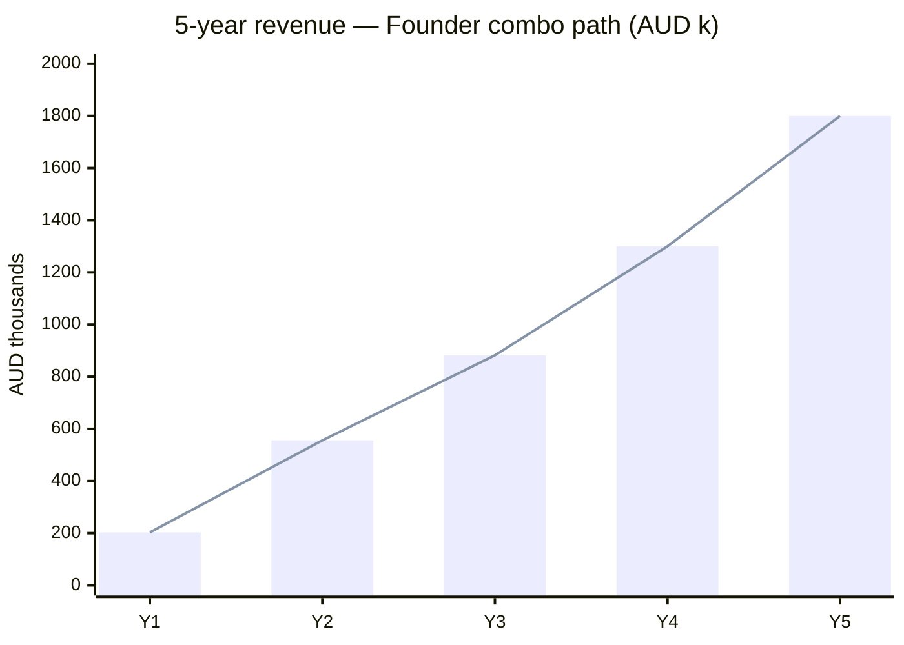
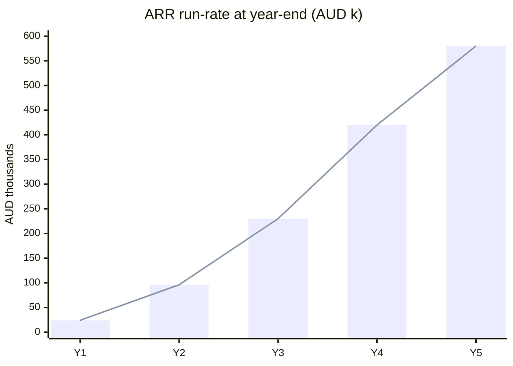
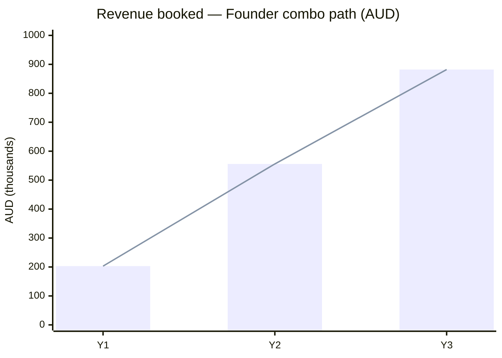
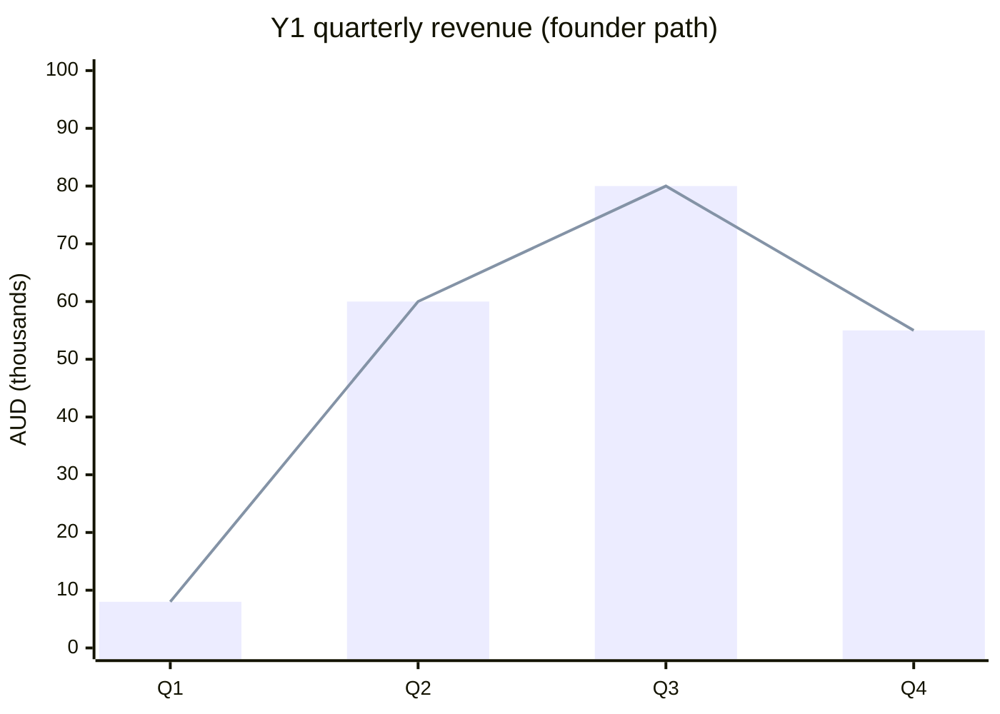

# Revenue Forecast — Option A + B Combo

**Model:** Hosted wedge (Option B) → on-prem turnkey conversion (Option A)  
**Currency:** AUD, booked revenue, ex GST  
**Scenarios:** Founder combo path (active) vs scale path (post-seed reference)

---

## Strategy in one line

Land **Option B** (hosted QuickStart) → convert **Option A** (on-prem production + support). Option B dominates Y1; Option A dominates Y2+.

---

## Founder combo path (present to mentors)

*Assumes: angel bridge post-Adneo, hire #1 delivery engineer, 40% pilot→on-prem conversion, minimal Managed Lite.*

### Annual revenue by SKU

| Year | Option B (hosted) | Option A (on-prem) | **Total** | Option A % |
|------|-------------------|---------------------|-----------|------------|
| **Y1** | $110k | $93k | **$203k** | 46% |
| **Y2** | $204k | $352k | **$556k** | 63% |
| **Y3** | $264k | $618k | **$882k** | 70% |
| **Y4** | $320k | $980k | **$1,300k** | 75% |
| **Y5** | $360k | $1,440k | **$1,800k** | 80% |

*Y4–Y5 assume **seed closed** (~month 18): 2 sales, 3 delivery, conversion rate 50%+. See [5-year detail](#5-year-forecast) below.*

### Y1 build-up (how you get to ~$200k)

| Stream | SKU | Calculation | Revenue |
|--------|-----|-------------|---------|
| Adneo production | B | 1 × $50k (discounted hosted prod) | $50k |
| Law QuickStarts | B | 4 × $12k founding | $48k |
| Team pilots (hosted) | B | 1 × $28k | $28k |
| First on-prem conversion | A | 1 × $70k production | $70k |
| Support | A/B | 2 × $10k | $20k |
| Hardware margin | A | 12% on $25k box | $3k |
| | | **Y1 total** | **~$219k** |

*Rounded to **~$200k** in [plan.md](../plan.md) to allow Adneo discount and slip.*

### Y2 build-up

| Stream | SKU | Calculation | Revenue |
|--------|-----|-------------|---------|
| New QuickStarts / pilots | B | 8 × $13k avg | $104k |
| Hosted production (no convert) | B | 2 × $50k | $100k |
| On-prem production (new + Y1 converts) | A | 5 × $70k | $350k |
| Support ARR | A | 8 × $12k | $96k |
| Hardware margin | A | 5 × $3k | $15k |
| | | **Y2 total** | **~$665k** |

*Conservative adjust to **$556k** for slower law outbound and 3 not 5 on-prem deals.*

### Y3 build-up

| Stream | SKU | Calculation | Revenue |
|--------|-----|-------------|---------|
| New pilots | B | 10 × $15k | $150k |
| Hosted production | B | 2 × $55k | $110k |
| On-prem production | A | 7 × $70k | $490k |
| Support ARR | A | 18 × $12k | $216k |
| Hardware margin | A | 7 × $3k | $21k |
| Managed Lite (holdouts only) | B | 1 × $42k | $42k |
| | | **Y3 total** | **~$1,029k** |

*Haircut to **$882k** for founder-led GTM without full seed sales team.*

### Y4 build-up (post-seed)

*Seed ~$1.5M closes month 14–18. Inside sales + second delivery engineer.*

| Stream | SKU | Calculation | Revenue |
|--------|-----|-------------|---------|
| New pilots | B | 14 × $15k | $210k |
| Hosted production | B | 2 × $55k | $110k |
| On-prem production | A | 9 × $70k | $630k |
| Support ARR | A | 28 × $12k | $336k |
| Hardware margin | A | 9 × $3k | $27k |
| Managed Lite (holdouts) | B | 2 × $42k | $84k |
| | | **Y4 total** | **~$1,397k** |

*Rounded to **$1.3M** for enterprise sales cycle slippage.*

### Y5 build-up

| Stream | SKU | Calculation | Revenue |
|--------|-----|-------------|---------|
| New pilots | B | 16 × $16k | $256k |
| Hosted production | B | 2 × $60k | $120k |
| On-prem production | A | 10 × $75k | $750k |
| Support ARR | A | 38 × $12k | $456k |
| Hardware margin | A | 10 × $3.5k | $35k |
| Managed Lite | B | 3 × $42k | $126k |
| | | **Y5 total** | **~$1,743k** |

*Rounded to **$1.8M**. Optional Y5 Track B enterprise ($150–450k) not included — upside only.*

---

## 5-year forecast

### Summary table

| Year | Total booked | YoY growth | Option A % | Active support | ARR exit* | Cumulative logos |
|------|--------------|------------|------------|----------------|----------|------------------|
| **Y1** | $200k | — | 46% | 2 | $24k | 6 |
| **Y2** | $550k | +175% | 63% | 8 | $96k | 14 |
| **Y3** | $880k | +60% | 70% | 18 | $230k | 24 |
| **Y4** | $1.3M | +48% | 75% | 28 | $420k | 38 |
| **Y5** | $1.8M | +38% | 80% | 38 | $580k | 50 |

*ARR exit = active support contracts + Managed Lite (annualised). Does not include one-time production fees.*

### 5-year revenue chart

### Option A vs B — 5 years

```mermaid
xychart-beta
    title "5-year mix — Hosted wedge vs On-prem"
    x-axis ["Y1", "Y2", "Y3", "Y4", "Y5"]
    y-axis "AUD thousands" 0 --> 1500
    bar "Option B hosted" [110, 204, 264, 320, 360]
    bar "Option A on-prem" [93, 352, 618, 980, 1440]
```

### ARR compounding

Support base compounds as on-prem installs age; one-time production stays lumpy.

### Recurring share of booked revenue

| Year | One-time | Recurring (support + Managed) | Recurring % |
|------|----------|----------------------------|-------------|
| Y1 | $179k | $24k | 12% |
| Y2 | $460k | $96k | 17% |
| Y3 | $666k | $216k | 25% |
| Y4 | $880k | $420k | 32% |
| Y5 | $1,220k | $580k | **32%** |

Target **40%+ recurring by Y6** as support base matures and upsells slow.

---

## 5-year scale path (reference)

*If pre-seed + seed land on schedule and Track B enterprise closes. Extrapolated from [financial-model-assumptions.md](../financial-model-assumptions.md).*

| Year | Total booked | Notes |
|------|--------------|-------|
| Y1 | $492k | 8 pilots; 3 production |
| Y2 | $1,980k | Sales team; Managed Lite |
| Y3 | $3,404k | 24 pilots; 2 enterprise |
| Y4 | $5,200k | 32 pilots; 4 enterprise; MSP prep |
| Y5 | $7,500k | Path to **$5M+ ARR** narrative |

```mermaid
xychart-beta
    title "5-year — Founder combo vs Scale path (AUD k)"
    x-axis ["Y1", "Y2", "Y3", "Y4", "Y5"]
    y-axis "AUD thousands" 0 --> 8000
    bar "Founder combo" [203, 556, 882, 1300, 1800]
    bar "Scale path" [492, 1980, 3404, 5200, 7500]
```

---

## Logos and conversion (5-year)

| Metric | Y1 | Y2 | Y3 | Y4 | Y5 |
|--------|----|----|-----|-----|-----|
| New pilots | 5–6 | 8–10 | 10–12 | 14 | 16 |
| Cumulative logos | 6 | 14 | 24 | 38 | 50 |
| Pilot → on-prem conversion | 40% | 45% | 50% | 50% | 55% |
| Cumulative on-prem production | 2 | 7 | 15 | 24 | 34 |
| Active support contracts | 2 | 8 | 18 | 28 | 38 |

---

## Milestones by year

| Year | Business milestone |
|------|-------------------|
| **Y1** | Adneo live; angel bridge; hire #1; first law on-prem |
| **Y2** | 14 logos; on-prem &gt;60% revenue; ISO scoping |
| **Y3** | ~$230k ARR; seed-ready; 24 logos |
| **Y4** | Seed closed; inside sales; **~$420k ARR**; EBITDA path visible |
| **Y5** | 50 logos; **~$580k ARR**; 34 on-prem installs; optional Track B enterprise |

*Financial model projects EBITDA positive around Y4–Y5 at 35+ production customers and $800k+ ARR on the **scale path**. Founder combo reaches profitability later without enterprise deals — or earlier if 1–2 Track B closes in Y4–Y5.*

---

## What to tell mentors (5-year)

> "We book ~$200k Year 1 on the wedge, ~$900k Year 3 as on-prem becomes 70% of revenue, and **~$1.8M Year 5** with ~$580k ARR from support. Option B opens the door; Option A is where margin and sovereignty live. With seed and enterprise upsell, the scale path hits **$7M+ booked by Year 5**."

---

### Total revenue (founder combo path)

### Option A vs Option B mix

```mermaid
xychart-beta
    title "Revenue mix — Option B (hosted) vs Option A (on-prem)"
    x-axis ["Y1", "Y2", "Y3"]
    y-axis "AUD (thousands)" 0 --> 700
    bar "Option B — hosted wedge" [110, 204, 264]
    bar "Option A — on-prem" [93, 352, 618]
```

### Y1 quarterly ramp

| Quarter | Option B | Option A | Total | Milestone |
|---------|----------|----------|-------|-----------|
| Q1 | $8k | $0 | **$8k** | Adneo SOW; demo ready |
| Q2 | $50k | $10k | **$60k** | Adneo production booked |
| Q3 | $40k | $40k | **$80k** | Law QuickStarts; first on-prem convert |
| Q4 | $12k | $43k | **$55k** | Support + second on-prem |

---

## Scale path (reference — post $650k pre-seed)

*From [financial-model-assumptions.md](../financial-model-assumptions.md). Requires inside sales + 2 delivery. Includes Track B enterprise.*

| Year | Total revenue | Notes |
|------|---------------|-------|
| Y1 | $492k | 8 pilots; 3 production |
| Y2 | $1,980k | 18 pilots; 9 production; Managed Lite starts |
| Y3 | $3,404k | 24 pilots; 13 production; 2 enterprise |

```mermaid
xychart-beta
    title "Revenue — Founder combo vs Scale path (AUD)"
    x-axis ["Y1", "Y2", "Y3"]
    y-axis "AUD (thousands)" 0 --> 3500
    bar "Founder combo" [203, 556, 882]
    bar "Scale path" [492, 1980, 3404]
```

---

## Logos and conversion

| Metric | Y1 | Y2 | Y3 |
|--------|----|----|-----|
| New pilots (Option B entry) | 5–6 | 8–10 | 10–12 |
| Cumulative logos | 6 | 14 | 24 |
| Pilot → on-prem conversion | 40% | 45% | 50% |
| On-prem production deals (cumulative) | 1–2 | 5–7 | 12–15 |
| Support contracts (active) | 2 | 8 | 18 |

---

## Recurring vs one-time (Y3)

| Type | Amount | % of Y3 |
|------|--------|---------|
| One-time (pilots + production + HW margin) | $666k | 75% |
| Recurring (support + Managed Lite) | $216k | 25% |

**ARR run-rate exiting Y3:** ~$230k (support + 1–2 Managed Lite holdouts). Target **35%+ recurring by Y4** as support base compounds.

---

## Key assumptions

| Assumption | Value |
|------------|-------|
| Founding QuickStart | $12k |
| Avg pilot (blended) | $13–15k |
| On-prem Team Production | $70k |
| Hosted production (Adneo-style) | $50–55k |
| Annual support | $12k |
| Pilot → on-prem conversion | 40% → 55% by Y5 |
| Managed Lite | Deferred; max 2–3 holdouts |
| Seed round | $1.5M ~month 18 (Y2/Y3 boundary) |
| Track B enterprise | Not in founder combo Y1–Y5 base; upside |
| AWS GPU hosting | **Not modelled** — convert to on-prem |

---

## What to tell mentors

> "Year 1 is ~$200k — mostly hosted wedge plus one on-prem conversion. By Year 3 we're at ~$900k with **70% from on-prem**. **Year 5: ~$1.8M booked, ~$580k ARR**, 50 logos. Option B is the door; Option A is the business. With seed and enterprise, the scale path exceeds **$7M by Year 5**."

---

*Update after Adneo SOW closes with actual deal values. Link: [hosted-vs-onprem-cogs.md](hosted-vs-onprem-cogs.md) · [unit-economics.md](unit-economics.md)*
