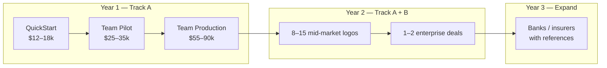

# Track A — Mid-Market Entry Strategy

**Version:** 1.0  
**Date:** July 2026  
**Status:** Primary GTM (supersedes enterprise-first for Year 1)  
**Parent document:** [sovereign-warden-business-plan.md](sovereign-warden-business-plan.md)  
**Funding implications:** [seed-funding-implications.md](seed-funding-implications.md)

---

## Strategic Rationale

Enterprise-first GTM (500–5,000 employees, Big 4 banks, major insurers) offers high ACV but **12–18 month sales cycles**, reference requirements, and procurement friction that kill pre-seed momentum.

**Track A** targets regulated mid-market organisations (50–250 employees) as the Year 1 engine:

- Faster decisions (4–10 weeks vs 6–18 months)
- Lower ACV but **6–10× more addressable organisations**
- Same sovereignty pain (client data, Privacy Act, shadow ChatGPT)
- Platform POC tier maps directly ([hardware-sizing.md](../hardware-sizing.md): 5–15 users, $3k–8k CapEx)

**Track B** (enterprise, 500+) remains the expansion lane from Year 2 once Track A delivers logos, runbooks, and case studies.

---

## Market Sizing (Track A)

ABS employment bands (June 2025):

| Segment | Count | Track |
|---------|-------|-------|
| 20–199 employees | ~68,000 | **Track A core** |
| 200–499 employees | ~4,000 (est.) | Track A upper / Track B lower |
| 500+ employees | ~1,300 (est.) | Track B |
| 1,000+ employees | ~300–600 (est.) | Track B (banks, majors) |

**Track A SAM:** Regulated knowledge-work firms in 50–250 employee range  
= ~15–25% of 20–199 band → **~10,000–17,000 organisations**

**Track A SOM (Year 3):** 15–25 active customers with 3-year cumulative 40–60 logos

---

## Ideal Customer Profile (Track A)

| Attribute | Target |
|-----------|--------|
| **Employees** | 50–250 (15–75 AI users in pilot) |
| **Verticals (priority)** | Mid-tier law, accounting/advisory, wealth/boutique finance, private health/aged care, regional mutual banks/credit unions |
| **Trigger** | Staff using ChatGPT with client/confidential data; partner/manager mandate for approved tool |
| **Buyer** | Managing partner, COO, GM, sole IT manager (1–2 signatories) |
| **Budget authority** | $15k–40k without board approval; $55k+ may need partner vote |
| **Tech stack** | M365 common but not required; manual doc upload acceptable in Year 1 |
| **Exclude (Year 1)** | Big 4 banks, federal government, defence, ASX 50 |

### Vertical Priority Matrix

| Vertical | Cycle speed | ACV potential | Reference value | Year 1 priority |
|----------|-------------|---------------|-----------------|-----------------|
| Mid-tier law (50–150 lawyers) | Fast | Medium | High | **#1** |
| Accounting / advisory | Fast | Medium | Medium | **#2** |
| Wealth / boutique finance | Medium | Medium–High | High | **#3** |
| Private health / aged care | Medium | Medium | Medium | **#4** |
| Regional mutual / credit union | Medium | Medium | High (finance) | **#5** |
| Big 4 banks | Very slow | Very high | Very high | **Year 2+** |

---

## Product & Pricing (Track A)

Enterprise price card remains for Track B. Track A uses a **simplified, fixed-price ladder**:

| Package | Users | Duration | Price (AUD, ex GST) | Platform |
|---------|-------|----------|---------------------|----------|
| **QuickStart** | 10–15 | 2 wk setup + 4 wk use | $12,000–$18,000 | POC profile, 1 RAG workspace, manual upload |
| **Team Pilot** | 15–30 | 6 weeks | $25,000–$35,000 | POC, 2 workspaces, RBAC |
| **Team Production** | 30–75 | 8 weeks | $55,000–$90,000 | POC extended or small on-prem GPU |
| **Annual Support** | — | 12 months | $6,000–$18,000/yr | Fixed tier, not % of deploy |
| **Managed Lite** | — | Monthly | $2,500–$5,000/mo | Optional; monitoring + updates |

### Pricing Rules (Track A)

1. **No paid discovery** — free 30-min fit call → QuickStart or Team Pilot SOW
2. **Founding customer:** first 3 QuickStarts at $12k (case study + logo rights)
3. **100% pilot fee credited** toward Team Production if signed within 45 days
4. **Do not discount below $12k** — use scope reduction, not price
5. **Copilot anchor:** 50 users × $45/mo × 12 = $27k/yr — QuickStart is comparable to one year of Copilot for half the team

### Delivery Productisation (Required for Margin)

Every Track A deployment uses the **same runbook**:

- `./scripts/bootstrap-poc.sh` + demo workspace config
- Standard 3 workspaces (General, Company Knowledge, Admin-only Agent)
- Template security policy adapted from [security-policy.md](../../demo/documents/security-policy.md)
- Max **2 concurrent QuickStarts** per delivery person

Target delivery cost:

| Package | Target delivery cost | Target GM |
|---------|---------------------|-----------|
| QuickStart | $4,000–$5,500 | 65–70% |
| Team Pilot | $10,000–$14,000 | 55–60% |
| Team Production | $30,000–$45,000 | 45–50% |
| Support (annual) | $2,000–$4,000 | 70–80% |

---

## Sales Motion (Track A)

| Stage | Duration | Activity | Exit criteria |
|-------|----------|----------|---------------|
| Fit call | 30 min | Demo screenshot + sovereignty one-pager | Prospect agrees to proposal |
| Proposal | 2–5 days | QuickStart or Team Pilot SOW | Signed + 50% deposit |
| Delivery | 2–8 weeks | Templated deploy + user onboarding | Success report delivered |
| Conversion call | 1 hr | Review metrics; Team Production proposal | Signed or nurture |
| Support renewal | Annual | Quarterly check-in | Renewed |

**Target sales cycle:** 4–10 weeks (fit call → signed QuickStart)

---

## Revenue Model (Track A Base Case)

### Volume Assumptions

| Metric | Year 1 | Year 2 | Year 3 |
|--------|--------|--------|--------|
| QuickStart / Team Pilot closes | 8 | 18 | 24 |
| Avg pilot fee | $28,000 | $30,000 | $32,000 |
| Pilot → production conversion | 40% | 50% | 55% |
| Team Production deals | 3 | 9 | 13 |
| Avg production fee | $70,000 | $75,000 | $80,000 |
| Support attach rate | 60% | 75% | 80% |
| Avg annual support | $12,000 | $14,000 | $15,000 |
| Track B enterprise deals | 0 | 1 | 2 |

### Revenue Projection (Track A Primary)

| Stream | Year 1 | Year 2 | Year 3 |
|--------|--------|--------|--------|
| Pilots (Track A) | $224,000 | $540,000 | $768,000 |
| Production (Track A) | $210,000 | $675,000 | $1,040,000 |
| Support (Track A) | $58,000 | $189,000 | $360,000 |
| Managed Lite | $0 | $60,000 | $180,000 |
| Track B enterprise | $0 | $450,000 | $950,000 |
| **Total** | **$492,000** | **$1,914,000** | **$3,298,000** |

### Customer Count

| Metric | Year 1 | Year 2 | Year 3 |
|--------|--------|--------|--------|
| New pilot customers | 8 | 18 | 24 |
| Production customers (cumulative) | 3 | 12 | 25 |
| Active support contracts | 5 | 14 | 28 |
| **Total logos (cumulative)** | **8** | **22** | **42** |

---

## Cost Structure (Track A)

Track A shifts spend from **compliance** to **delivery throughput and inside sales**.

### Year 1 Opex (Mid-Market Primary)

| Category | Enterprise-first plan | Track A plan | Delta |
|----------|----------------------|--------------|-------|
| Founder salary | $150k | $150k | — |
| Delivery (contract → FTE Month 5) | $100k | $120k | +$20k (earlier hire) |
| Sales / marketing | $50k | $65k | +$15k (vertical content, events) |
| Cloud POC / demos | $18k | $24k | +$6k (more pilot envs) |
| Compliance / IRAP docs | $30k (in pre-seed) | $10k | −$20k (defer to Y2) |
| Legal, insurance | $30k | $30k | — |
| Tools | $18k | $22k | +$4k (CRM, automation) |
| **Total** | **~$366k** | **~$421k** | **+$55k** |

Higher Year 1 opex is offset by **earlier revenue** (QuickStart in Week 6–8 vs enterprise pilot in Month 4–6).

### Break-Even Timing

| Model | First revenue | Cash break-even (revenue covers opex) |
|-------|---------------|--------------------------------------|
| Enterprise-first | Month 4–6 | Month 16–18 |
| **Track A primary** | **Month 2–3** | **Month 12–14** |

---

## Track A vs Track B — When to Use Which

| Signal from prospect | Route |
|---------------------|-------|
| <250 employees, buyer is GM/Partner | Track A QuickStart |
| 250–500 employees, IT-led, 8-week budget | Track A Team Pilot → Production |
| 500+ employees, CISO involved, RFP process | Track B (require 1+ Track A reference) |
| Government / IRAP mandatory | Track B — defer until IRAP docs complete |
| Big 4 bank / ASX 50 | Track B — Year 2+ only; nurture list |

---

## Kill Criteria (Track A)

| Trigger | Threshold | Action |
|---------|-----------|--------|
| Zero paid QuickStarts | 4 months active outbound | Fix vertical/offer; not a market problem |
| QuickStart delivery cost | >65% of fee | Stop custom work; enforce runbook |
| Pilot → production conversion | <25% after 8 pilots | Adjust production pricing or scope |
| Support attach | <40% after 6 production deploys | Bundle support into production |

---

## 90-Day Action Plan (Track A)

| Week | Action |
|------|--------|
| 1–2 | Productise QuickStart runbook; rehearse 10-min demo (not 15-min enterprise demo) |
| 2 | Build **50-user Copilot vs QuickStart** one-pager (not 1,000-user TCO) |
| 3 | Draft QuickStart + Team Pilot SOWs (no discovery SOW) |
| 4–5 | Name 30 accounts: 15 law firms, 15 accounting/advisory (50–200 staff) |
| 6–8 | 10 fit calls; target 3 QuickStart proposals |
| 8–10 | Close 2 QuickStarts ($12k founding price) |
| 10–12 | Deliver first QuickStart; document case study template |
| Ongoing | Add 1 Track B enterprise to nurture list per month (no active pursuit) |

---

## Integration with Main Business Plan

| Main plan section | Track A adjustment |
|-------------------|-------------------|
| §1 Executive Summary | Primary ICP = 50–250 employees; enterprise = Year 2 |
| §2 Market | SAM = ~10k–17k (Track A); enterprise SAM unchanged for Track B |
| §3 Product | Add QuickStart / Team Pilot / Team Production packages |
| §6 Pricing | Dual price card (Track A + Track B) |
| §7 Revenue | Use Track A volume model for Year 1–2 |
| §9 GTM | Phase 1 = Track A verticals; Phase 3 = Track B enterprise |
| §10 Funding | See [seed-funding-implications.md](seed-funding-implications.md) |
| §12 Viability | Team/readiness score improves (+0.5) with faster feedback loops |

---

*Track A is the recommended primary GTM. Enterprise (Track B) remains in plan as the expansion and valuation-upside lane, not the Year 1 revenue bet.*
