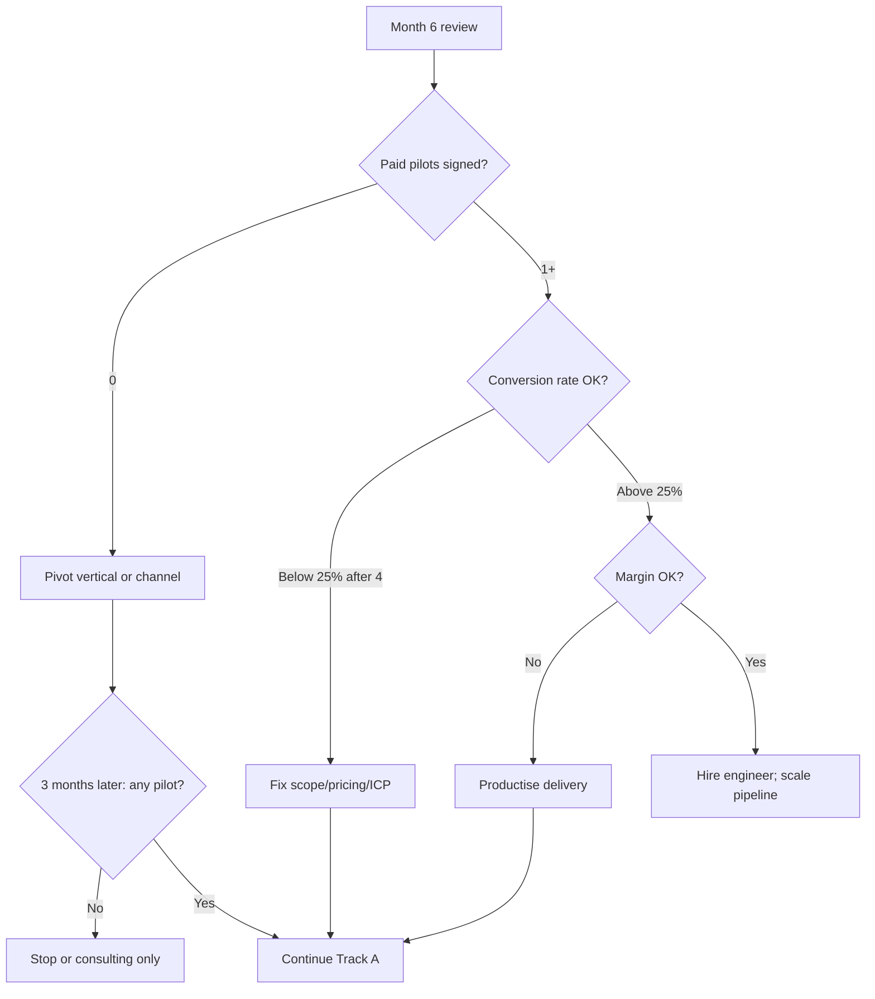

# Agent Thread 10: Risk, Scenarios, and Kill Criteria

**Purpose:** Intellectual honesty about failure modes for investors and founder discipline.

**Status:** Complete (aligned with [viability-review.md](../viability-review.md)).

---

## Key Decisions

| Decision | Recommendation |
|----------|----------------|
| Personal stop review | **Month 6** if zero paid pilots after active outbound |
| Primary pivot (if K1 hit) | **Vertical** (law → accounting) before product pivot |
| Acceptable risk | Crowded market, solo founder sales — mitigated by Track A speed |
| Existential risk | **Pilot conversion &lt;25%** + **no network** for pipeline refill |

---

## Decision Questions and Answers

| # | Question | Answer |
|---|----------|--------|
| 10.1 | Zero pilots by Month 6? | **Pivot vertical** → if no change in 3 months, **stop** (K1) |
| 10.2 | Max time pre-revenue before income needed? | **FOUNDER INPUT** — plan assumes 6–9 months with raise |
| 10.3 | Single assumption that kills business? | **Founder cannot sell** OR **pilot conversion &lt;25%** |
| 10.4 | Conservative $320k Y1 — still worth it? | **Yes** if learning + 4+ logos; **extend runway** not stop |
| 10.5 | Month 12 success beyond revenue? | QuickStart &lt;5 days; 3 case studies; repeatable SOW; seed-ready metrics |
| 10.6 | Avoid price war with funded players? | **Don't compete on price** — compete on speed, UX, mid-market focus; walk from RFPs |

---

## Risk Register

| ID | Risk | Likelihood | Impact | Owner | Trigger | Mitigation | Action if triggered |
|----|------|------------|--------|-------|---------|------------|---------------------|
| R1 | Zero paid pilots in 6 months | Medium | Critical | Founder | K1: 0 SOWs | 20-account list; warm intros | Pivot vertical; 3-month retest; stop |
| R2 | Pilot conversion &lt;25% | Medium | High | Founder | K2 after 4 pilots | Success metrics in SOW; exec sponsor | Reassess pricing/scope/ICP |
| R3 | Delivery margin collapse | Medium | High | Founder | K3: cost &gt;70% fee | Time tracking; runbook | Raise price; reduce scope |
| R4 | Funding gap | Medium | Critical | Founder | K4: M6 $0 rev, no funding | Bootstrap consulting; angel note | Consulting hybrid or stop |
| R5 | Founder burnout | High | Critical | Founder | K5: capacity exceeded | Cap 1 concurrent; hire M4–5 | Hire immediately or cap pipeline |
| R6 | Funded competitor undercuts | Low | Medium | Founder | Lost deal on price | Vertical focus; speed | Walk away; don't discount below $12k |
| R7 | Key-person delivery | High | High | Founder | Sick during pilot | Fractional backup; docs | Pause sales until hire |
| R8 | IRAP-required deal in Y1 | Low | Low | Founder | Gov RFP | Qualify out | Defer to Track B |
| R9 | AnythingLLM upstream change | Low | Medium | Founder | License/roadmap shift | Maintain fork | Pin version; evaluate alternatives |
| R10 | Copilot price drop | Medium | Medium | Founder | Copilot &lt;$30/user | TCO on ownership + sovereignty | Emphasise on-prem path |

---

## Scenario Decision Tree

---

## Scenario Outcomes (Updated)

| Scenario | Probability | Y1 revenue | Decision |
|----------|-------------|------------|----------|
| **Best** | 20% | $780k+ | Accelerate seed Month 12 |
| **Base** | 50% | $492k | Proceed; seed Month 14–18 |
| **Conservative** | 25% | $320k | Proceed; extend runway; reduce hire |
| **Failure** | 5% | &lt;$100k | Kill criteria; pivot or stop |

---

## Kill Criteria (from Viability Review)

| # | Trigger | Threshold | Action |
|---|---------|-----------|--------|
| K1 | Zero paid pilots | 6 months active outbound | Pivot vertical; +3 months then stop |
| K2 | Conversion failure | &lt;25% after 4 pilots | Reassess pilot scope/pricing/ICP |
| K3 | Unit economics broken | Delivery &gt;70% of fee | Raise price or fix runbooks |
| K4 | Funding + revenue gap | M6: $0 revenue, no funding | Consulting or stop |
| K5 | Founder burnout | Can't deliver concurrent pilots | Hire or cap at 1 pilot |

---

## Monthly Review Cadence

| Review | Focus | Data required |
|--------|-------|---------------|
| Weekly | Pipeline movement | CRM stages |
| Monthly | Kill criteria K1–K5 | SOW count, hours, bank balance |
| Day 90 | C1 pass/fail | 2 QuickStarts or 1 Team Pilot |
| Month 6 | K1, K4 | Revenue, funding status |
| Month 9 | C2 progress | Conversion rate |
| Month 12 | Seed readiness | Logos, ARR, deploy time |

---

## Pivot Options (Ranked)

| Rank | Pivot | When | Effort |
|------|-------|------|--------|
| 1 | Vertical (law → accounting) | K1 weak pipeline in law | Low |
| 2 | Channel (MSP referral) | Founder sales insufficient | Medium |
| 3 | SKU (Team Pilot only, skip QuickStart) | QuickStart margin fails K3 | Low |
| 4 | Product (oracle-ui vertical pack) | Services don't convert | High |
| 5 | Services-only consulting | Platform doesn't differentiate | Medium |
| 6 | Stop | K1 + pivot failed | — |

---

## Output Checklist

- [x] Risk register with triggers
- [x] Scenario decision tree
- [x] Kill criteria aligned with viability review
- [x] Monthly review cadence
- [ ] Personal stop date / runway (founder — 10.2)
- [ ] Probability weights adjusted after first 90 days
