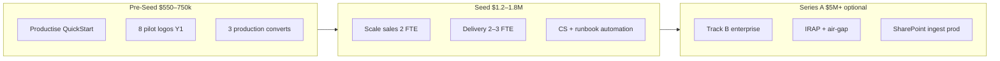

# Seed Funding Implications — Mid-Market (Track A) Strategy

**Version:** 1.0  
**Date:** July 2026  
**Parent documents:** [mid-market-track-a-strategy.md](mid-market-track-a-strategy.md), [financial-model-assumptions.md](financial-model-assumptions.md)

This document models how the Track A pivot changes **pre-seed**, **seed**, and **post-seed** capital requirements, use of funds, milestones, and investor narrative.

---

## Executive Summary

| | Enterprise-first (original) | Track A mid-market (recommended) |
|--|----------------------------|----------------------------------|
| **Pre-seed ask** | $750k | **$550k–650k** (or $750k for extra runway) |
| **Pre-seed runway** | 18 months | **18–22 months** (faster revenue offset) |
| **Seed ask** | $1.5–2.5M (implied) | **$1.2–1.8M** |
| **Seed timing** | Month 18–24 | **Month 14–18** (earlier if metrics hit) |
| **Seed milestone: customers** | 3 paying | **10+ logos, 6+ production** |
| **Seed milestone: ARR** | $500k+ (support + managed) | **$350k–500k ARR** (lower per logo, more logos) |
| **Primary seed spend** | Compliance + enterprise delivery | **Sales + delivery automation + CS** |
| **Investor story** | "Land enterprise sovereign AI" | **"Productised sovereign AI for mid-market; expand up"** |

**Bottom line:** Track A reduces **pre-seed risk** (revenue sooner, more shots on goal) but seed capital still needed to **hire for volume** — you trade one $300k deal for ten $30k deals, and that requires people and process.

---

## Funding Stages Overview

---

## Pre-Seed: Cost Implications

### Recommended Raise

| Option | Amount | When to choose |
|--------|--------|----------------|
| **Lean** | **$550,000** | Strong founder network; first QuickStart by Month 2 |
| **Standard** | **$650,000** | Recommended — buffer for 2 delivery hires |
| **Comfortable** | **$750,000** | Part-time founder or slower network; 22-month runway |

**Valuation:** $2.5–3.5M pre-money (slightly lower than enterprise-only story at pre-seed, but closes faster with traction)

### Use of Funds (Standard $650k)

| Category | Enterprise-first ($750k) | Track A ($650k) | Change |
|----------|-------------------------|-----------------|--------|
| Team (founder + engineer + 0.5 sales) | $450k (60%) | **$390k (60%)** | −$60k; engineer from Month 4 not Month 7 |
| GTM (demos, vertical events, founding subsidies) | $120k (16%) | **$130k (20%)** | +$10k; law/accounting events |
| Compliance / IRAP docs | $80k (11%) | **$25k (4%)** | **−$55k deferred to seed** |
| Platform hardening (SSO, ingest) | $60k (8%) | **$35k (5%)** | −$25k; manual upload OK for Track A |
| Cloud / demo environments | (in GTM) | **$30k (5%)** | Multi-tenant demo stacks |
| Reserve | $40k (5%) | **$40k (6%)** | — |
| **Total** | **$750k** | **$650k** | **−$100k** |

### Pre-Seed Milestones (Track A)

| Milestone | Target date | Evidence |
|-----------|-------------|----------|
| QuickStart runbook live | Month 1 | Documented + timed deploy |
| First paid QuickStart | Month 2–3 | Signed SOW |
| 4 QuickStarts completed | Month 6 | Case study draft |
| 2 Team Production conversions | Month 9 | Signed deploy SOWs |
| 8 cumulative pilot logos | Month 12 | CRM |
| **ARR (support + managed)** | **$60k+ by Month 12** | 5+ support contracts |
| Gross margin on QuickStart | >60% | Time tracking |

### Pre-Seed: Revenue vs Burn

| Month | Cumulative revenue (base) | Cumulative opex | Net burn |
|-------|---------------------------|-----------------|----------|
| 3 | $24k (2 × founding QuickStart) | $105k | −$81k |
| 6 | $96k (4 pilots + 1 prod deposit) | $210k | −$114k |
| 9 | $210k | $315k | −$105k |
| 12 | $492k | $421k | **+$71k** (operating cash positive in Month 11–12) |

With $650k pre-seed, **net cash at Month 12 ≈ $650k − $350k net burn + $492k revenue ≈ $792k** — enough to optionally **delay seed** or raise from strength.

*Conservative case (4 pilots, 1 production): Month 12 revenue ~$220k; net cash ~$450k — still 6+ months runway without seed.*

---

## Seed Round: Cost Implications

### When to Raise Seed

| Trigger | Track A threshold |
|---------|-------------------|
| **Minimum** | 6 production customers OR $250k ARR + 12 logos |
| **Recommended** | 10+ logos, $400k ARR, QuickStart deploy <5 business days |
| **Strong** | $500k ARR, 40%+ pilot→production, 1 Track B enterprise in pipeline |

**Timing:** Month 14–18 (vs Month 18–24 enterprise-first)

### Recommended Seed Raise

| | Low | Recommended | High |
|--|-----|-------------|------|
| **Amount** | $1.2M | **$1.5M** | $1.8M |
| **Pre-money** | $6M | **$7–8M** | $10M |
| **Dilution** | ~17% | **~16–19%** | ~18% |
| **Runway** | 18 months | **20 months** | 24 months |

Higher pre-money justified by: **logo count**, **repeatable playbook**, **ARR slope** — not single enterprise whale.

### Use of Seed Funds ($1.5M)

| Category | Amount | % | Purpose |
|----------|--------|---|---------|
| **Sales** | $450,000 | 30% | 2 inside sales FTE (law + accounting verticals); CRM; outbound tools |
| **Delivery** | $420,000 | 28% | 2 delivery engineers; runbook automation; deploy scripts |
| **Customer success** | $180,000 | 12% | 1 CS FTE; onboarding templates; support tier |
| **Marketing** | $150,000 | 10% | Case studies, vertical content, conference sponsorship |
| **Platform** | $120,000 | 8% | SharePoint ingest (Phase 2); SSO production; multi-tenant ops |
| **Compliance (Track B prep)** | $90,000 | 6% | IRAP-aligned docs; ISO 27001 scoping |
| **G&A / reserve** | $90,000 | 6% | Legal, finance, contingency |
| **Total** | **$1,500,000** | **100%** | |

### Seed Opex Model (Year 2 Post-Raise)

| Category | Monthly | Annual |
|----------|---------|--------|
| Salaries (6 FTE + founders) | $95,000 | $1,140,000 |
| Contractors / overflow delivery | $8,000 | $96,000 |
| Cloud / demo / customer POC infra | $5,000 | $60,000 |
| Sales & marketing | $12,000 | $144,000 |
| Tools, legal, insurance | $5,000 | $60,000 |
| **Total opex** | **~$125,000** | **~$1,500,000** |

**Year 2 revenue (Track A base):** ~$1.91M  
**Year 2 gross profit (~50%):** ~$955k  
**Year 2 EBITDA:** ~**−$545k** (investment year — normal for seed stage)

Seed capital covers the gap while building **repeatable volume machine**.

### Headcount Plan (Seed → Month 24)

| Role | Pre-seed (M12) | Post-seed (M15) | Post-seed (M24) |
|------|----------------|-----------------|-----------------|
| Founder / CEO | 1 | 1 | 1 |
| Founder / CTO or delivery lead | 0–1 | 1 | 1 |
| Delivery engineer | 1 | 2 | 3 |
| Inside sales | 0 | 1 | 2 |
| Customer success | 0 | 0.5 | 1 |
| **Total FTE** | **2–3** | **5–6** | **8–9** |

---

## Seed Milestones (What Investors Will Expect)

| Metric | Weak | Acceptable | Strong |
|--------|------|------------|--------|
| Cumulative logos | 6 | **10–15** | 20+ |
| Production customers | 3 | **6–8** | 12+ |
| ARR (support + managed) | $150k | **$350–500k** | $600k+ |
| Pilot → production conversion | 25% | **40–50%** | 55%+ |
| QuickStart deploy time | 10 days | **5 days** | 2 days (automated) |
| Gross margin (blended) | 40% | **48–52%** | 55%+ |
| Net revenue retention | N/A | **>100%** | >110% |
| Track B pipeline | 0 | **2+ qualified** | 1 signed |
| Monthly burn | $130k | **$100–125k** | <$100k with revenue |

**Track A seed story:** *"We productised sovereign AI deployment for mid-market professional services. We have 12 logos, $400k ARR, 5-day deploy, and 45% conversion. Seed capital scales sales and delivery to 40 customers and opens enterprise (Track B)."*

---

## Cost Comparison: Enterprise-First vs Track A (3-Year)

| | Enterprise-first | Track A primary |
|--|------------------|-----------------|
| **Total raised (pre-seed + seed)** | $750k + $2.0M = **$2.75M** | $650k + $1.5M = **$2.15M** |
| **Year 1 customers** | 1–2 | **8** |
| **Year 2 customers (cumulative)** | 4–6 | **22** |
| **Year 3 ARR** | ~$310k (support) | **~$540k** (support + managed) |
| **Year 3 total revenue** | ~$2.97M | ~$3.30M |
| **Compliance spend by Year 3** | $130k+ (early IRAP) | **$90k** (deferred, then spike for Track B) |
| **Key person risk at seed** | High (1 whale customer) | **Lower** (distributed base) |
| **Series A readiness** | Needs enterprise logo | **Needs Track B logo OR $1M+ ARR** |

**Capital efficiency:** Track A raises **~$600k less** to reach similar Year 3 revenue, with better logo diversity and earlier revenue.

---

## Unit Economics at Seed Stage

### Track A Customer Lifecycle

| Stage | Revenue | Delivery cost | Gross profit |
|-------|---------|---------------|--------------|
| QuickStart | $15,000 | $5,000 | $10,000 |
| Team Production (upgrade) | $70,000 | $38,000 | $32,000 |
| Support (3 years) | $36,000 | $9,000 | $27,000 |
| **3-year LTV** | **$121,000** | **$52,000** | **$69,000** |

### CAC at Seed

| Channel | CAC | LTV:CAC |
|---------|-----|---------|
| Founder outbound | $3,000–$5,000 | **14–23:1** |
| Inside sales (loaded) | $8,000–$12,000 | **6–9:1** |
| Partner referral | $5,000–$8,000 | **9–14:1** |

Target blended CAC at seed: **<$10,000** (healthy for B2B services)

### What Gets Worse vs Enterprise

| Metric | Enterprise | Track A | Implication |
|--------|------------|---------|-------------|
| ACV | $270k+ | $85k avg | Need 3× customers for same revenue |
| Delivery touches | Few, heavy | Many, light | Must automate or margins collapse |
| Support ticket volume | Low | Higher | CS hire at seed is non-optional |
| Investor "whale" appeal | One big logo | None until Track B | Compensate with growth rate + ARR slope |

---

## Investor Narrative (Seed Deck Framing)

### Problem
Mid-market professional firms (50–250 staff) can't use ChatGPT for client work and can't afford 12-month enterprise AI projects.

### Solution
Productised Sovereign Warden: **5-day QuickStart**, ChatGPT UX, fixed pricing, path to on-prem.

### Traction (example at seed)
- 12 logos in 14 months
- $420k ARR (support + managed)
- 45% pilot→production
- 2 law firm case studies

### Use of funds
Scale **repeatable delivery** and **vertical sales** — not R&D.

### Moat
Runbook + reference density in AU legal/accounting verticals → upsell to enterprise Track B.

### Exit / scale path
- **Path 1:** Volume mid-market ($5M ARR, 200 customers)
- **Path 2:** Move upmarket with references ($10M+ ARR, blended)
- **Path 3:** Platform licensing to MSPs (Year 4+)

---

## Risks to Seed Fundraising (Track A Specific)

| Risk | Investor concern | Mitigation |
|------|------------------|------------|
| "Services business, not SaaS" | Multiple low-ACV projects | Show ARR + automated deploy time trending down |
| "Can't scale delivery" | Linear headcount | Runbook metrics; target 1 engineer : 8 active pilots |
| "No enterprise logo" | Can't move upmarket | Track B pipeline slide; regional bank LOI |
| "Lower gross margin" | QuickStart is small | Bundle upgrades; 40%+ convert to production |
| "Competitive market" | Cetus, Premya | Vertical focus + transparent pricing + speed |

---

## Decision Matrix: How Much to Raise

| Your situation | Pre-seed | Seed |
|----------------|----------|------|
| Solo founder, strong law/accounting network | $550k | $1.2M at 10 logos |
| Co-founder team, moderate network | **$650k** | **$1.5M at 12 logos** |
| Need 24-month runway without revenue stress | $750k | $1.8M |
| Bootstrap to 4 QuickStarts, then raise | $0–300k angels | $1.5M from strength |

---

## Summary: What Changes for You

1. **Pre-seed can be smaller** ($650k vs $750k) because IRAP/enterprise platform work moves to seed.
2. **Revenue comes 2–4 months earlier** — reduces net burn before seed.
3. **Seed is still required** (~$1.5M) to hire sales + delivery for volume — you cannot run 20+ customers on founder alone.
4. **Seed milestones shift** from "1 enterprise whale" to **"10 logos + $400k ARR + 45% conversion"**.
5. **Seed spend shifts** from compliance (11%) to **sales + delivery (58%)**.
6. **Total capital to Year 3 profitability path: ~$2.15M** vs ~$2.75M enterprise-first — **~22% less dilution** for comparable revenue.
7. **Series A trigger:** $1M+ ARR OR first Track B enterprise ($450k+) with 25+ mid-market logos.

---

*See [financial-model-assumptions.md](financial-model-assumptions.md) Section 9 for Track A spreadsheet inputs.*
