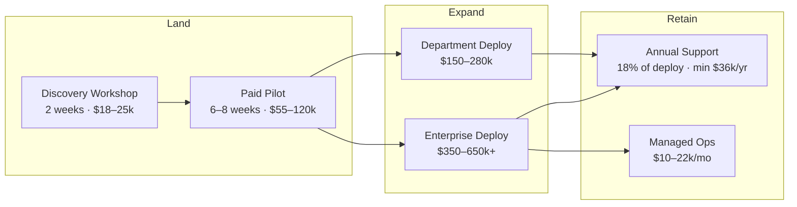
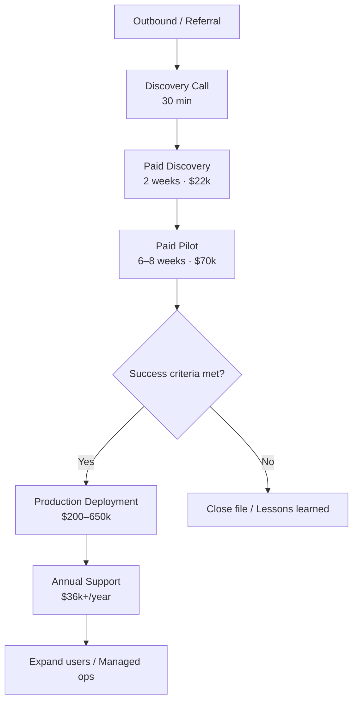

# Sovereign Warden — Comprehensive Business Plan

**Version:** 1.1  
**Date:** July 2026  
**Confidentiality:** Internal / Investor Use  
**Related documents:** [replan/README.md](replan/README.md) (granular replan threads), [mid-market-track-a-strategy.md](mid-market-track-a-strategy.md) (primary GTM), [seed-funding-implications.md](seed-funding-implications.md), [pitch-deck/index.html](pitch-deck/index.html) (angel deck), [competitor-matrix.md](competitor-matrix.md), [financial-model-assumptions.md](financial-model-assumptions.md)

> **GTM update (v1.1):** Year 1 primary focus is **Track A mid-market** (50–250 employees). Enterprise (Track B, 500+) is the Year 2+ expansion lane. See [mid-market-track-a-strategy.md](mid-market-track-a-strategy.md).

---

## Table of Contents

1. [Executive Summary](#1-executive-summary)
2. [Problem & Market Opportunity](#2-problem--market-opportunity)
3. [Product & Service Offering](#3-product--service-offering)
4. [Competitive Analysis](#4-competitive-analysis)
5. [SWOT Analysis](#5-swot-analysis)
6. [Pricing Strategy](#6-pricing-strategy)
7. [Revenue Forecast](#7-revenue-forecast)
8. [Cost Structure & Unit Economics](#8-cost-structure--unit-economics)
9. [Go-to-Market Strategy](#9-go-to-market-strategy)
10. [Funding Plan](#10-funding-plan)
11. [Risk Register & Mitigations](#11-risk-register--mitigations)
12. [Viability Assessment](#12-viability-assessment-does-it-have-legs)
13. [90-Day Action Plan](#13-90-day-action-plan)
14. [Appendix: GTM Collateral Outline](#appendix-gtm-collateral-outline)
15. [Segmented GTM: Track A + Track B](#15-segmented-gtm-track-a--track-b)

---

## 1. Executive Summary

### The Opportunity

Australian mid-to-large enterprises (500–5,000 employees) in regulated industries face a structural conflict: employees demand ChatGPT-class AI productivity, but boards and regulators prohibit sending confidential data to US-hosted SaaS platforms. Shadow IT usage of public AI tools is widespread. Microsoft Copilot offers a familiar path but costs ~AU$45–50 per user per month, locks organisations into the Microsoft stack, and still routes prompts through US-controlled infrastructure.

### The Solution

**Sovereign Warden Platform** is a deployable, auditable, employee-ready AI stack built on proven open-source components (AnythingLLM, LiteLLM, Qdrant, vLLM). It delivers a ChatGPT-quality desktop and browser experience with RAG over company documents, role-based access control, and a clear migration path from cloud POC to on-premises or air-gapped production — **with zero application code changes**.

> *"We're not renting intelligence — we're building infrastructure we own."*

### Business Model

Hybrid services company with a **paid pilot → full deployment → annual support** land-and-expand model:

| Revenue stream | Description |
|----------------|-------------|
| Discovery workshops | Fixed-fee scoping and TCO analysis |
| Paid pilots | 6–8 week proof-of-value with 15–50 users |
| Deployments | Department and enterprise production rollouts |
| Hardware margin | Pass-through GPU/server bundles with 10–15% margin |
| Annual support | 18% of deployment fee (minimum $36k/year) |
| Managed operations | Optional remote ops retainer |

### Target Market

**Track A (Year 1 primary):** Regulated mid-market organisations with **50–250 employees** — mid-tier law, accounting/advisory, wealth/boutique finance, private health, regional mutual banks. ~10,000–17,000 addressable in Australia.

**Track B (Year 2+ expansion):** Mid-to-large enterprises (500–5,000 employees) in financial services, healthcare, mining, utilities, and insurance — including major banks once references and IRAP docs are in place.

Full segmentation: [mid-market-track-a-strategy.md](mid-market-track-a-strategy.md)

### Financial Snapshot (Track A Primary — Base Case)

| Metric | Year 1 | Year 2 | Year 3 |
|--------|--------|--------|--------|
| Revenue | $492k | $1.91M | $3.30M |
| Gross margin | ~48% | ~50% | ~52% |
| Headcount | 2–3 FTE | 6–7 FTE | 9–11 FTE |
| Pilot logos (cumulative) | 8 | 22 | 42 |
| Production customers (cumulative) | 3 | 12 | 25 |

### Funding Ask

**$650k AUD pre-seed** (recommended) at $2.5–3.5M pre-money for 18–22 month runway. Seed **$1.5M** at Month 14–18 with milestones: **10+ logos, $350–500k ARR, 40%+ pilot conversion**. Full capital model: [seed-funding-implications.md](seed-funding-implications.md)

### Go / No-Go Headline

**Verdict: PROCEED WITH CONDITIONS** (weighted viability score: 3.6 / 5.0)

| Supporting metric | Signal |
|-------------------|--------|
| Working POC stack with profile-switch architecture | Strong — technical de-risking complete |
| AU sovereign AI market with 5+ funded competitors | Strong — validated demand, crowded space |
| Year 1 achievable with 1 converted customer | Moderate — depends on founder sales network |

**Conditions:** Secure 1 paid discovery within 90 days; validate ≥1 pilot-to-deployment conversion by Month 9; complete IRAP-aligned documentation before targeting government.

**Section assumptions:** Base-case financials assume 50% pilot conversion in Year 1, lean 2–3 person team, and direct sales only (no channel revenue).  
**Viability signal:** 🟢 Green — market and product fundamentals support proceeding; execution risk is primary constraint.

---

## 2. Problem & Market Opportunity

### The Problem

1. **Productivity gap:** Enterprise employees use consumer AI tools (ChatGPT, Claude) for drafting, research, and summarisation — often pasting confidential content into unapproved systems.
2. **Compliance gap:** Privacy Act reforms, APRA CPS 234, and sector regulators require demonstrable data control. Public AI SaaS cannot satisfy air-gap or on-premises requirements for Restricted/Confidential data.
3. **Cost gap:** Microsoft Copilot at scale (1,000 users × $50/month = $600k/year) is a recurring OpEx line item with no CapEx alternative and no path to full sovereignty.
4. **Implementation gap:** Custom LLM builds from global SIs cost $120k–$600k+ and take 12–24 weeks with no guaranteed employee adoption. Employees reject API-only tools that lack a familiar chat interface.

### Market Sizing

| Layer | Definition | Estimate | Methodology |
|-------|------------|----------|-------------|
| **TAM** | Total AU enterprise AI spend (productivity + compliance + infrastructure) | **$2.0–4.0B by 2028** | Global enterprise AI spend (~$150B) × AU GDP share (~1.5%) × adoption curve |
| **SAM** | Regulated mid-large AU enterprises (500–5,000 employees) needing data sovereignty | **~2,000–3,000 organisations** | ABS business counts filtered by size + regulated NAICS/SIC equivalents |
| **SOM (Year 3)** | Realistic capture with 2–4 person sales + delivery team | **8–15 customers, $1.5–3.0M ARR** | 0.3–0.5% SAM penetration at avg $200k ACV |

### Demand Drivers (Australia-Specific)

| Driver | Impact | Timeline |
|--------|--------|----------|
| Privacy Act reforms (APP enhancements, penalties) | High | Active (2024–2026) |
| APRA CPS 234 / prudential AI guidance | High | Active |
| Shadow IT / unsanctioned AI usage incidents | High | Ongoing |
| Copilot cost backlash at 500+ seat scale | Medium | 2025–2027 |
| Government sovereign AI procurement (IRAP) | Medium | 2026–2028 |
| EU-style AI Act influence on AU policy | Low–Medium | 2027+ |

### Buyer Personas

| Role | Concerns | Message |
|------|----------|---------|
| **CIO / CDO** (economic buyer) | Cost, vendor lock-in, employee adoption | TCO vs Copilot; same UX employees already know |
| **CISO** (technical buyer) | Data residency, audit trail, air-gap | Data-flow diagram; LiteLLM logging; network segmentation |
| **General Counsel** | Regulatory compliance, liability | Approved-tool policy; citation-backed RAG for legal research |
| **Head of Innovation** (champion) | Speed to value, pilot success | 6-week paid pilot with measurable KPIs |
| **HR / People** | Policy assistant, handbook queries | Pre-built RAG workspace for employee policies |

### Section Assumptions

- SAM count of 2,000–3,000 assumes focus on finance, health, legal, mining, utilities, and insurance verticals only.
- TAM upper bound assumes continued AI adoption acceleration; lower bound assumes macro slowdown.
- Government sector excluded from Year 1–2 SOM (requires IRAP assessment not yet completed).

**Viability signal:** 🟢 Green — multiple independent demand drivers; market is real and growing.

---

## 3. Product & Service Offering

### Platform Foundation

The Sovereign Warden Platform (see [architecture.md](../architecture.md)) provides:

- **Employee UX:** Forked AnythingLLM Desktop (Electron) — exact upstream ChatGPT-class interface
- **Backend:** Dockerised AnythingLLM + LiteLLM + PostgreSQL + Redis + Nginx
- **RAG:** Document upload, vector search (Qdrant), in-chat citations
- **Governance:** Multi-user RBAC (Admin / Manager / Default), workspace access control, audit logging
- **Branding:** White-label logo, app name, theme
- **Profile switch:** POC (Gemini + Qdrant Cloud) → on-prem (vLLM/Ollama + local Qdrant) via env file swap
- **Roadmap:** SharePoint/Confluence ingest (Phase 2), SSO via Entra ID (Phase 2), K8s + air-gap (Phase 3)

### Service Packages

| Package | Deliverables | Platform profile | Duration | Price (AUD, ex GST) |
|---------|--------------|------------------|----------|---------------------|
| **Discovery** | Use-case workshop, data classification review, TCO vs Copilot analysis, architecture recommendation | N/A | 2 weeks | $18,000–$25,000 |
| **Paid Pilot (small)** | 15–30 users, 1 RAG workspace, success metrics report, desktop app distribution | POC (Gemini) or small on-prem GPU | 6 weeks | $55,000–$85,000 |
| **Paid Pilot (medium)** | 30–50 users, 2 RAG workspaces, SSO optional, agent workspace (admin) | POC or on-prem | 8 weeks | $85,000–$120,000 |
| **Department Deploy** | 50–200 users, SharePoint/Confluence ingest, production SSO, on-prem inference | On-prem overlay | 10–14 weeks | $150,000–$280,000 |
| **Enterprise Deploy** | 200–1,000+ users, air-gap option, K8s HA, multi-site | Phase 3 K8s | 16–24 weeks | $350,000–$650,000 |
| **Annual Support** | Platform updates, model migrations, monitoring, quarterly business reviews | Ongoing | 12 months | 18% of deployment (min $36k) |
| **Managed Operations** | Remote monitoring, patch management, incident response, capacity planning | Ongoing | Monthly | $10,000–$22,000/month |
| **Hardware Bundle** | GPU server spec, procurement, rack install (dept tier) | Per [hardware-sizing.md](../hardware-sizing.md) | Add-on | $18,000–$45,000 (+12% margin) |

### Data Sovereignty Progression

Clients start where risk tolerance allows and migrate without re-platforming:

| Stage | Documents | Embeddings | Chat history | LLM prompts |
|-------|-----------|------------|--------------|-------------|
| **POC** | Client storage / Qdrant tenant | Qdrant Cloud | Local PostgreSQL | Google Gemini API |
| **On-prem** | Rack-local MinIO | Local Qdrant | Local PostgreSQL | Local vLLM/Ollama |
| **Air-gap** | Sneakernet model updates | Fully isolated | Fully isolated | Zero egress |

### Key Differentiator

The paid pilot uses the **same production stack** that scales to full sovereignty. It is not a throwaway demo environment. When the client approves production deployment, the migration is an infrastructure profile switch — not a rebuild.

**Section assumptions:** Phase 2 ingest connectors (SharePoint, Confluence) are scaffolded but not production-hardened; pilot delivery may use manual document upload until Phase 2 is complete. Hardware bundles are optional and client-supplied hardware is always accepted.  
**Viability signal:** 🟢 Green — productised packages map cleanly to existing platform capabilities and documented hardware tiers.

---

## 4. Competitive Analysis

Detailed comparison matrix: [competitor-matrix.md](competitor-matrix.md)

### Competitive Landscape Summary

| Category | Key players | Their strength | Our advantage |
|----------|-------------|----------------|---------------|
| **Cloud SaaS AI** | Microsoft Copilot, ChatGPT Enterprise, Google Gemini | Fast rollout, frontier models, brand | Data sovereignty, flat economics at scale, no per-seat lock-in |
| **AU sovereign cloud SaaS** | Macquarie Launch AI | AU data residency, managed service | Employee desktop UX, client-owned infra, air-gap path |
| **AU sovereign on-prem** | Cetus AI, Premya, Allayze, Torrens AI | Compliance narrative, local presence, IRAP claims | Faster pilot (platform built), familiar UX, transparent pricing |
| **Global SI / dev shops** | TechAhead, DEV.co, local MSPs | Custom scope, large teams | Productised platform, lower cost, repeatable delivery |

### Positioning Statement

> For Australian regulated enterprises that need an **approved internal AI assistant** — not another API project — Sovereign Warden delivers a **productised platform** with ChatGPT-class UX, a **fixed-price paid pilot**, and a **zero-migration path** from cloud POC to on-prem or air-gap production.

### Competitive Moat Assessment (Honest)

| Moat factor | Rating | Notes |
|-------------|--------|-------|
| Time-to-pilot | Strong | POC stack operational today; competitors often quote 8–14 weeks to first demo |
| Open stack / no model lock-in | Strong | LiteLLM abstracts providers; swap Llama/Mistral/Qwen via config |
| Employee UX | Strong | AnythingLLM is a proven chat interface; not a custom rebuild |
| Brand / references | Weak | New entrant; zero AU case studies |
| IRAP / compliance certification | Weak | Cetus claims IRAP-ready; we have policy templates only |
| Sales capacity | Weak | Pre-seed team; competitors have established enterprise sales |
| Upstream dependency | Moderate | AnythingLLM Desktop fork (Option B) requires ongoing upstream sync |

**Section assumptions:** Competitor pricing is largely opaque (custom quotes); Copilot pricing is public and used as the primary TCO anchor. We do not compete on IRAP certification in Year 1.  
**Viability signal:** 🟡 Amber — differentiated on speed and UX, but crowded AU sovereign market requires sharp vertical focus and founder sales network.

---

## 5. SWOT Analysis

| | **Positive** | **Negative** |
|---|-------------|-------------|
| **Internal** | **Strengths** | **Weaknesses** |
| | Working POC stack with profile-switch architecture | Early-stage repo (single commit); no production deployments |
| | Familiar AnythingLLM UX drives adoption | No IRAP assessment or ISO 27001 certification |
| | MIT-licensed platform config; open stack | No AU customer references or case studies |
| | Clear air-gap and K8s roadmap documented | Founder delivery capacity limits concurrent engagements |
| | Hybrid revenue model (pilot + deploy + support) | AnythingLLM Desktop fork upstream dependency |
| | Land-and-expand economics with high-margin support | Brand unknown in enterprise procurement |
| **External** | **Opportunities** | **Threats** |
| | Privacy Act reforms increase compliance demand | Microsoft bundling Copilot into E5 at marginal cost |
| | Copilot cost backlash at 500+ seat deployments | Cetus, Premya, Macquarie established in AU sovereign AI |
| | SharePoint ingest wedge for M365-heavy enterprises | GPU supply chain volatility and cost inflation |
| | Government sovereign AI procurement (post-IRAP) | Open-source commoditisation (anyone can deploy Ollama) |
| | Shadow IT incidents create CISO urgency | Client "build it ourselves" with internal platform teams |
| | Pre-seed AI investment climate in AU | Economic downturn delaying enterprise CapEx |

### SWOT-Driven Strategic Priorities

1. **Leverage Strength + Opportunity:** Lead with paid pilot speed in regulated verticals experiencing Copilot cost pressure.
2. **Mitigate Weakness + Threat:** Productize delivery runbooks to reduce founder dependency; pin upstream versions.
3. **Avoid Weakness + Threat trap:** Do not compete on price with Premya/Cetus or on model quality with OpenAI — compete on employee UX + pilot-to-production path.

**Section assumptions:** SWOT reflects current state (pre-revenue, pre-seed); scores will shift materially with first customer reference.  
**Viability signal:** 🟢 Green — strengths align with market opportunity; weaknesses are addressable with funding and first deployments.

---

## 6. Pricing Strategy

### Pricing Principles

1. **Pilot is paid** — filters tire-kickers, covers delivery cost, creates conversion sunk cost.
2. **Anchor against Copilot TCO** — not hardware cost. A 1,000-user Copilot deployment costs ~$540k–600k/year in licenses alone.
3. **Hardware at cost + margin** — 10–15% procurement margin, or client-supplied (zero balance sheet risk).
4. **Support as percentage of deploy** — industry standard 15–20%/year; we target 18% with $36k minimum.
5. **Founding customer discount** — first 2 pilots at $45k–55k in exchange for case study and reference rights.

### Price Card (AUD, ex GST)

| Offering | Price range | Typical mid-point |
|----------|-------------|-------------------|
| Discovery workshop | $18,000–$25,000 | $22,000 |
| Paid pilot (15–30 users) | $55,000–$85,000 | $70,000 |
| Paid pilot (30–50 users) | $85,000–$120,000 | $100,000 |
| Department deployment | $150,000–$280,000 | $200,000 |
| Enterprise deployment | $350,000–$650,000 | $450,000 |
| Hardware bundle (dept tier) | $18,000–$45,000 | $30,000 |
| Annual support | 18% of deployment fee | Min $36,000/year |
| Managed operations | $10,000–$22,000/month | $15,000/month |

### TCO Comparison: Sovereign Warden vs Microsoft Copilot (1,000 users)

| Cost component | Copilot (Year 1) | Sovereign Warden (Year 1) | Sovereign Warden (Year 2+) |
|----------------|------------------|----------------------|------------------------|
| Licenses / platform | $540,000 | $0 | $0 |
| Pilot | $0 | $85,000 | $0 |
| Deployment | $0 | $350,000 | $0 |
| Hardware (dept tier) | $0 | $30,000 | $0 |
| Annual support | $0 | $63,000 | $63,000 |
| **Total** | **$540,000** | **$528,000** | **$63,000** |
| **3-year TCO** | **$1,620,000** | **$654,000** | — |

**Break-even vs Copilot:** ~11 months after production deployment. Year 2+ support-only cost is **88% lower** than annual Copilot licenses.

### Section Assumptions

- Copilot pricing at AU$45/user/month (ex GST) on top of existing M365 E3/E5 licenses.
- Sovereign Warden deployment excludes enterprise-tier H100 rack ($150k–400k CapEx) — quoted separately.
- Founding customer discount reduces Year 1 pilot average to ~$55k for first 2 customers.
- GST (10%) applies to all AU pricing but is excluded from comparisons above.

**Viability signal:** 🟢 Green — pricing is competitive against Copilot TCO at 200+ users; pilot price aligns with market rates ($55k–120k).

---

## 7. Revenue Forecast

Full assumptions and scenario modelling: [financial-model-assumptions.md](financial-model-assumptions.md)

### Base Case — 3-Year Revenue Projection

| Revenue stream | Year 1 | Year 2 | Year 3 |
|----------------|--------|--------|--------|
| Discovery workshops | $120,000 | $200,000 | $240,000 |
| Paid pilots | $210,000 | $450,000 | $640,000 |
| Deployments | $200,000 | $890,000 | $1,720,000 |
| Support & managed ops | $0 | $72,000 | $310,000 |
| Hardware margin | $5,000 | $25,000 | $60,000 |
| **Total revenue** | **$535,000** | **$1,637,000** | **$2,970,000** |

### Key Volume Assumptions (Base Case)

| Metric | Year 1 | Year 2 | Year 3 |
|--------|--------|--------|--------|
| Discovery workshops sold | 6 | 10 | 12 |
| Discovery → pilot conversion | 50% | 60% | 65% |
| Pilots sold | 3 | 6 | 8 |
| Pilot → deployment conversion | 33% | 50% | 63% |
| Department deployments | 1 | 2 | 3 |
| Enterprise deployments | 0 | 1 | 2 |
| Support contract renewals | — | 80% | 85% |
| Active customers (cumulative) | 1 | 4 | 10 |

### Scenario Summary

| Scenario | Year 1 | Year 2 | Year 3 | Trigger |
|----------|--------|--------|--------|---------|
| **Conservative** | $320k | $980k | $1.85M | 25% pilot conversion; 1 FTE delay |
| **Base** | $535k | $1.64M | $2.97M | 50% pilot conversion; plan hiring |
| **Optimistic** | $780k | $2.1M | $3.8M | 70% pilot conversion; channel partner |

### Year 1 Credibility Test

Year 1 base case requires only:
- 1 department deployment ($200k)
- 3 paid pilots ($210k total)
- 6 discovery workshops ($120k)

This is achievable with a single converted customer and 2–3 active pipeline opportunities — critical for pre-seed investor credibility.

**Section assumptions:** Revenue recognised on delivery completion (pilots and deployments), not booking. No channel/partner revenue in base case. Average deal sizes per [financial-model-assumptions.md](financial-model-assumptions.md).  
**Viability signal:** 🟢 Green — Year 1 target is modest (1 converted customer); upside scales with conversion rate improvements.

---

## 8. Cost Structure & Unit Economics

### Year 1 Operating Costs (Lean Pre-Seed Team)

| Category | Low | High | Notes |
|----------|-----|------|-------|
| Founder salary (1–2, below market) | $120,000 | $180,000 | Deferred/top-up at Seed |
| Contract delivery engineer | $80,000 | $120,000 | Part-time → full-time Month 6 |
| Sales & marketing | $40,000 | $60,000 | Events, content, travel, demo infra |
| Cloud POC costs (Gemini, Qdrant demos) | $12,000 | $24,000 | Per-demo environment |
| Legal, accounting, insurance | $25,000 | $35,000 | PI insurance, contracts |
| Tools & infrastructure | $15,000 | $20,000 | GitHub, monitoring, CRM |
| **Total opex** | **$292,000** | **$439,000** | |

### Gross Margin by Revenue Stream

| Stream | Target gross margin | Primary cost |
|--------|-------------------|--------------|
| Discovery | 60–70% | Founder/principal time (2 weeks) |
| Paid pilot | 55–65% | Delivery engineer (6–8 weeks) + cloud inference |
| Deployment | 40–50% | Delivery team (10–24 weeks) + possible subcontract |
| Support | 70–80% | Quarterly reviews + ad-hoc patches |
| Managed ops | 50–60% | Ongoing monitoring labour |
| Hardware margin | 10–15% | Procurement and logistics only |

### Unit Economics (Per Customer Lifecycle)

| Stage | Revenue | Delivery cost | Gross profit | Gross margin |
|-------|---------|---------------|--------------|--------------|
| Discovery | $22,000 | $8,000 | $14,000 | 64% |
| Pilot | $70,000 | $30,000 | $40,000 | 57% |
| Dept deployment | $200,000 | $110,000 | $90,000 | 45% |
| Year 1 support | $36,000 | $10,000 | $26,000 | 72% |
| **Full lifecycle (Year 1)** | **$328,000** | **$158,000** | **$170,000** | **52%** |

### Break-Even Analysis

| Metric | Value |
|--------|-------|
| Year 1 opex (mid) | ~$365,000 |
| Required revenue at 45% GM | ~$811,000 |
| Base case Year 1 revenue | $535,000 |
| **Gap** | **$276,000** |
| Gap coverage | Pre-seed funding + 1 additional deployment in Year 1 |

With pre-seed funding ($750k), runway extends to 18+ months. Cash break-even (revenue covers opex without funding) projected at **Month 14–18** in base case.

**Section assumptions:** Founder takes below-market salary; no office rent (remote). Delivery costs assume 1 contract engineer, not full team. Subcontractor rates at $150–200/hour for overflow.  
**Viability signal:** 🟡 Amber — unit economics are healthy per customer, but Year 1 requires funding bridge until 2+ customers are live.

---

## 9. Go-to-Market Strategy

### Phase 1: Prove One Logo (Months 1–6)

**Objective:** Close 1 founding pilot and convert to department deployment.

| Activity | Detail |
|----------|--------|
| **Target verticals** | Financial services, professional services (legal/accounting), healthcare admin |
| **Target accounts** | 20 named accounts with warm intro paths |
| **Channel** | Direct outbound to CIO/CISO; partner with AU cybersecurity consultancies |
| **Collateral** | 15-min demo (from [poc-demo-script.md](../poc-demo-script.md)); TCO one-pager; discovery deck |
| **Offer** | Founding customer pilot at $45k–55k (case study + reference rights) |
| **Success metric** | 2 paid discoveries → 1 pilot → 1 deployment LOI |

### Phase 2: Repeatable Delivery (Months 7–12)

**Objective:** Productize delivery; hire first FTE engineer; achieve 50% pilot conversion.

| Activity | Detail |
|----------|--------|
| **Productize** | Pilot SOW, deployment runbook, acceptance test checklist |
| **Runbooks** | Derived from [bootstrap-poc.sh](../../scripts/bootstrap-poc.sh) and [migrate-to-onprem.sh](../../scripts/migrate-to-onprem.sh) |
| **Compliance** | IRAP-aligned documentation pack (from [security-policy.md](../../demo/documents/security-policy.md) template) |
| **Hiring** | Delivery engineer #1 (Month 7) |
| **Success metric** | 3 pilots completed; ≥1 deployment; 2 support contracts signed |

### Phase 3: Scale (Year 2)

**Objective:** Build sales engine; expand verticals; target $500k+ ARR.

| Activity | Detail |
|----------|--------|
| **Team** | 2 sales + 2 delivery FTEs |
| **Channel** | Microsoft partner ecosystem (SharePoint ingest wedge) |
| **Certification** | ISO 27001 or SOC 2 for company (not just client deployments) |
| **Verticals** | Add mining, utilities, insurance |
| **Success metric** | 4–6 active customers; $500k+ ARR; 1 enterprise reference |

### Sales Process

**Section assumptions:** No paid marketing in Year 1; all pipeline from direct outreach and partner referrals. Sales cycle assumed 3–6 months (discovery to pilot), 2–4 months (pilot to deployment).  
**Viability signal:** 🟡 Amber — GTM is sound but entirely dependent on founder network for Phase 1; no channel revenue assumed.

---

## 10. Funding Plan

### Recommended Raise

| Term | Value |
|------|-------|
| **Amount** | $750,000 AUD |
| **Stage** | Pre-seed / Angel |
| **Pre-money valuation** | $3.0–4.0M |
| **Runway** | 18 months |
| **Instrument** | SAFE or convertible note (founder preference) |

### Use of Funds

| Category | Amount | % | Purpose |
|----------|--------|---|---------|
| Team | $450,000 | 60% | Founder + 1 engineer + 0.5 sales (contract) |
| GTM | $120,000 | 16% | Demos, events, founding pilot subsidies, travel |
| Compliance prep | $80,000 | 11% | IRAP-aligned docs, legal templates, PI insurance |
| Platform hardening | $60,000 | 8% | Phase 2 ingest connectors, SSO production-ready |
| Reserve | $40,000 | 5% | Contingency |

### Milestones for Seed Round (Month 18–24)

| Milestone | Target | Evidence |
|-----------|--------|----------|
| Paying customers | 3+ | Signed contracts |
| Enterprise reference | 1 | Named logo + case study |
| ARR (support + managed) | $500k+ | Recurring revenue run rate |
| Pilot → deploy conversion | >50% | Pipeline data |
| IRAP-aligned controls pack | Complete | Documentation audit |
| Team | 5–6 FTE | Org chart |

### Capital Efficiency Narrative

Unlike pure SaaS startups requiring 24+ months to revenue, this model can generate **$200k+ from a single customer in Year 1** (pilot + deployment). Pre-seed funding extends runway to build a repeatable sales and delivery engine — not to fund R&D of an unproven product. The platform POC already exists.

**Section assumptions:** Raise closes within 3 months of launch. No revenue included in use-of-funds (conservative). Seed round at $8–12M pre-money if milestones hit.  
**Viability signal:** 🟢 Green — capital requirement is modest relative to revenue potential; milestones are concrete and measurable.

---

## 11. Risk Register & Mitigations

| # | Risk | Likelihood | Impact | Mitigation | Residual risk |
|---|------|------------|--------|------------|---------------|
| R1 | Long enterprise sales cycles (9–18 mo) | High | High | Paid discovery + 6-week pilot compresses decision window | Medium |
| R2 | Copilot "good enough" for non-regulated teams | Medium | Medium | Target regulated verticals only; lead with CISO | Low |
| R3 | Delivery capacity bottleneck | High | High | Productized runbooks; cap concurrent pilots at 2 | Medium |
| R4 | AnythingLLM upstream breaking changes | Medium | Medium | Pin versions ([UPSTREAM.md](../../desktop/UPSTREAM.md)); maintain fork | Low |
| R5 | GPU supply / cost volatility | Medium | Low | Client-supplied hardware option; start POC on cloud | Low |
| R6 | Competitor undercuts on pilot price | Medium | Medium | Compete on conversion path + UX, not cheapest pilot | Medium |
| R7 | Pilot conversion below 25% | Medium | High | Strict success criteria in SOW; executive sponsor requirement | Medium |
| R8 | Founder key-person dependency | High | High | Document runbooks; hire delivery engineer by Month 7 | Medium |
| R9 | IRAP requirement blocks government deals | Medium | Medium | Complete IRAP-aligned docs; defer gov until Year 2 | Low |
| R10 | Economic downturn delays enterprise CapEx | Medium | High | Offer POC-only engagements; reduce deployment scope | Medium |

**Section assumptions:** Risk register reviewed quarterly. No cybersecurity insurance claim history assumed.  
**Viability signal:** 🟡 Amber — manageable risk profile; R1, R3, R7, R8 are the critical four requiring active monitoring.

---

## 12. Viability Assessment ("Does It Have Legs?")

### Scoring Framework

Each dimension scored 1–5. **≥3.5 = proceed**, **2.5–3.4 = pivot**, **<2.5 = stop**.

| Dimension | Weight | Score | Weighted | Rationale |
|-----------|--------|-------|----------|-----------|
| Market demand | 20% | 4.0 | 0.80 | Real AU sovereign AI market; Privacy Act tailwind; 5+ competitors validate demand |
| Differentiation | 15% | 3.5 | 0.53 | Productized platform vs custom builds; crowded sovereign space |
| Unit economics | 15% | 4.0 | 0.60 | 52% lifecycle gross margin; support is high-margin recurring |
| Technical feasibility | 15% | 4.5 | 0.68 | POC exists; profile-switch works; clear migration path |
| Team / readiness | 15% | 2.5 | 0.38 | **Founder-dependent; sales network unvalidated** |
| Competitive moat | 10% | 3.0 | 0.30 | Speed-to-pilot helps; brand and IRAP are gaps |
| Capital efficiency | 10% | 4.0 | 0.40 | Revenue from 1 customer covers significant opex |
| **Total** | **100%** | — | **3.69** | **PROCEED WITH CONDITIONS** |

### Verdict: PROCEED WITH CONDITIONS

The Sovereign Warden Platform business has **fundamentally sound market, product, and economic characteristics**. The primary risk is execution — specifically, the founder's ability to convert network into paid discoveries and pilots within 90 days.

### Conditions to Proceed

| # | Condition | Deadline | Status |
|---|-----------|----------|--------|
| C1 | Secure 1 LOI or paid discovery | Day 90 | ⬜ Pending founder input |
| C2 | Validate ≥1 pilot-to-deployment conversion | Month 9 | ⬜ Pending |
| C3 | Complete IRAP-aligned documentation before targeting government | Month 12 | ⬜ Pending |
| C4 | Do not compete on price — compete on employee UX + pilot speed | Ongoing | ⬜ Policy |

### Kill Criteria (Stop or Pivot)

| Trigger | Threshold | Action |
|---------|-----------|--------|
| Zero paid pilots after active outbound | 6 months | Pivot GTM or stop |
| Pilot conversion rate | <25% after 4 pilots | Reassess pricing, scope, or vertical |
| Delivery cost exceeds pilot revenue | >70% of pilot fee | Fix delivery model or raise prices |
| No funding + no revenue | Month 6 | Bootstrap with consulting or stop |

### Gaps Requiring Founder Input

| Gap | Impact | Question for founder |
|-----|--------|---------------------|
| **Sales network** | Critical for C1 | How many CIO/CISO contacts do you have in target verticals? |
| **Vertical focus** | Affects GTM messaging | Which 1–2 verticals have your strongest network? |
| **Technical delivery** | Affects hiring timeline | Can you deliver pilots solo, or is engineer hire Day 1? |
| **Co-founder / team** | Affects scoring on Team dimension | Solo founder or team in place? |
| **Existing entity** | Affects funding timeline | Is a legal entity formed? IP assignment clear? |

**Viability signal:** 🟢 Green (conditional) — score of 3.69 supports proceeding; conditions are achievable within 90 days with founder commitment.

---

## 13. 90-Day Action Plan

| Week | Action | Owner | Deliverable | Success criteria |
|------|--------|-------|-------------|------------------|
| 1–2 | Finalize customer demo environment | Founder | Working POC stack + demo script | 15-min demo reproducible |
| 2 | Build TCO one-pager | Founder | Copilot vs Sovereign Warden comparison (500/1000/2000 seats) | PDF ready for discovery calls |
| 3–4 | Draft SOW templates | Founder | Discovery, Pilot, Deployment, Support SOWs | Legal review ready |
| 4–6 | Build target account list | Founder | 20 named accounts in 2 verticals | Warm intro path for ≥10 |
| 6–8 | Run discovery calls | Founder | 5+ discovery calls completed | 2+ advance to paid discovery |
| 8–10 | Close paid discoveries | Founder | 2 paid discovery engagements | $44k+ booked |
| 10–12 | Close founding pilot | Founder | 1 pilot SOW signed | $45k–55k booked |
| Ongoing | Partner outreach | Founder | 3 cybersecurity consultancies engaged | 1 referral agreement |

See [Appendix: GTM Collateral Outline](#appendix-gtm-collateral-outline) for detailed specs on SOW templates, TCO calculator, and checklist.

**Section assumptions:** Founder is full-time on GTM from Day 1. Demo environment uses existing bootstrap scripts. Legal review of SOWs via standard template lawyer (~$2k).  
**Viability signal:** 🟢 Green — plan is concrete, time-bound, and achievable with existing platform assets.

---

## Appendix: GTM Collateral Outline

### A.1 SOW Template Specifications

#### A.1.1 Discovery Workshop SOW

| Section | Content |
|---------|---------|
| **Scope** | 2-week engagement: stakeholder interviews (3–5), use-case prioritisation workshop, data classification review, TCO analysis (Copilot vs sovereign), architecture recommendation document |
| **Deliverables** | Use-case matrix (ranked), data classification map, TCO comparison spreadsheet, architecture diagram, recommended pilot scope |
| **Acceptance criteria** | Client sign-off on use-case matrix and pilot scope document |
| **Price** | $18,000–$25,000 (ex GST); 50% credited toward pilot if signed within 30 days |
| **Timeline** | 10 business days from kickoff |
| **Prerequisites** | Executive sponsor identified; access to 3–5 stakeholders; sample data classification policy |

#### A.1.2 Paid Pilot SOW

| Section | Content |
|---------|---------|
| **Scope** | 6–8 week engagement: platform deployment (POC profile), 1–2 RAG workspaces, 15–50 user onboarding, desktop app distribution, weekly check-ins, success metrics report |
| **Deliverables** | Deployed Sovereign Warden Platform (POC), configured workspaces, user accounts, desktop installer, success metrics report with recommendation |
| **Success criteria** | ≥70% user activation (logged in at least once); ≥3 documented use-case wins; NPS ≥7 from pilot users; CISO sign-off on data-flow review |
| **Price** | $55,000–$120,000 depending on user count and scope |
| **Timeline** | 6 weeks (small) or 8 weeks (medium) from kickoff |
| **Prerequisites** | Signed discovery report or equivalent; executive sponsor; document corpus for RAG (minimum 10 documents) |
| **Conversion clause** | 100% of pilot fee credited toward deployment if signed within 60 days of pilot completion |

#### A.1.3 Department Deployment SOW

| Section | Content |
|---------|---------|
| **Scope** | 10–14 week production deployment: on-prem profile migration, SharePoint/Confluence ingest (if applicable), production SSO (Entra ID), 50–200 user rollout, admin training, security review |
| **Deliverables** | Production Sovereign Warden Platform (on-prem), SSO integration, ingest pipelines, runbook documentation, admin training session |
| **Acceptance criteria** | Platform passes security review; SSO functional; ≥90% target users provisioned; runbook delivered |
| **Price** | $150,000–$280,000 (excludes hardware) |
| **Timeline** | 10–14 weeks from kickoff |
| **Prerequisites** | Completed pilot with successful outcome; hardware procured or client-supplied; SSO tenant access |

#### A.1.4 Annual Support SOW

| Section | Content |
|---------|---------|
| **Scope** | 12-month support: platform updates, model migration assistance, quarterly business reviews, email/Slack support (business hours), critical incident response (4-hour SLA) |
| **Deliverables** | Quarterly review reports, update release notes, incident log |
| **Price** | 18% of deployment fee; minimum $36,000/year |
| **Renewal** | Auto-renew annually unless 90-day notice |

### A.2 TCO Calculator Specification

Build a spreadsheet (Google Sheets or Excel) with the following inputs and outputs:

#### Inputs

| Input | Default | Notes |
|-------|---------|-------|
| Number of users | 500 / 1000 / 2000 | Pre-set tabs for each |
| Copilot price per user/month | $45 | AU$ ex GST |
| Existing M365 E3/E5 base cost | $0 (excluded) | Optional add |
| Pilot user count | 30 | Subset for pilot phase |
| Sovereign Warden pilot fee | $70,000 | Fixed |
| Sovereign Warden deployment fee | $200,000 | Department tier |
| Sovereign Warden hardware | $30,000 | Optional |
| Sovereign Warden support (% of deploy) | 18% | Recurring |
| Analysis period | 3 years | |

#### Outputs

| Output | Formula |
|--------|---------|
| Copilot Year 1 cost | users × $45 × 12 |
| Copilot 3-year TCO | Year 1 × 3 |
| Sovereign Warden Year 1 cost | pilot + deployment + hardware + support |
| Sovereign Warden Year 2 cost | support only |
| Sovereign Warden Year 3 cost | support only |
| Sovereign Warden 3-year TCO | Sum of above |
| Break-even month | Month where cumulative Sovereign Warden < cumulative Copilot |
| Year 2+ annual savings | Copilot annual − Sovereign Warden support annual |
| Savings percentage | (Copilot 3yr − Sovereign Warden 3yr) / Copilot 3yr |

#### Presentation

- One-page PDF summary for discovery calls
- Full spreadsheet for technical/finance stakeholders
- Include footnote: "Copilot pricing as of July 2026; M365 base license excluded"

### A.3 90-Day GTM Checklist

Derived from [poc-demo-script.md](../poc-demo-script.md):

#### Pre-Launch (Week 0)

- [ ] Legal entity formed with IP assignment to company
- [ ] Professional indemnity insurance quoted/bound
- [ ] Demo environment reproducible via `./scripts/bootstrap-poc.sh`
- [ ] Demo users configured: `admin`, `manager-demo`, `employee-demo`
- [ ] Three demo workspaces: General Assistant, Company Knowledge, Agent Workspace
- [ ] Demo documents uploaded (HR handbook, security policy, leave policy)
- [ ] Desktop client built or browser fallback tested at `http://localhost:3000`

#### Week 1–2: Demo Ready

- [ ] 15-minute demo script rehearsed (Acts 1–4 from poc-demo-script)
- [ ] Demo runs end-to-end without errors
- [ ] Gemini API key verified: `./scripts/verify-litellm.sh`
- [ ] Architecture diagram slide exported from docs/architecture.md
- [ ] "Closing line" memorised: sovereignty path narrative

#### Week 2–3: Collateral

- [ ] TCO one-pager completed (500/1000/2000 seat scenarios)
- [ ] Discovery deck (10 slides): problem, solution, demo screenshots, TCO, pilot offer
- [ ] One-page company overview (problem, solution, team, ask)
- [ ] SOW templates drafted (Discovery, Pilot, Deployment, Support)

#### Week 4–6: Pipeline

- [ ] 20 target accounts identified with company, contact, vertical, intro path
- [ ] LinkedIn profiles researched for CIO/CISO at target accounts
- [ ] 3 cybersecurity consultancy partners identified for referral
- [ ] Founding customer offer finalised ($45k–55k pilot for case study)
- [ ] CRM or tracking spreadsheet set up

#### Week 6–10: Discovery Calls

- [ ] 5+ discovery calls completed
- [ ] Call notes and follow-up actions logged
- [ ] 2+ prospects advance to paid discovery proposal
- [ ] Paid discovery SOW sent to 2 prospects

#### Week 10–12: First Revenue

- [ ] 1+ paid discovery signed ($22k)
- [ ] 1 founding pilot SOW sent
- [ ] 1 founding pilot signed ($45k–55k)
- [ ] Pilot kickoff scheduled

#### Ongoing

- [ ] Weekly pipeline review (30 min)
- [ ] Monthly metrics: calls, proposals, bookings, conversion rates
- [ ] Quarterly strategy review against kill criteria

---

## 15. Segmented GTM: Track A + Track B

Year 1 execution follows **Track A mid-market** as the primary revenue engine. Enterprise **Track B** is nurture-only until Month 12+.

| | Track A (Primary) | Track B (Expansion) |
|--|-------------------|---------------------|
| **Employees** | 50–250 | 500–5,000 |
| **Year 1 focus** | QuickStart + Team Pilot | Nurture list only |
| **Entry offer** | $12k–35k QuickStart / Team Pilot | $55k+ paid pilot (from Month 12) |
| **Sales cycle** | 4–10 weeks | 6–18 months |
| **Buyer** | Partner, GM, IT manager | CIO, CISO, procurement |
| **Year 1 logos** | 8 | 0 |
| **Compliance** | Privacy Act + firm policy | IRAP-aligned docs required |

Full strategy, pricing, and 90-day plan: [mid-market-track-a-strategy.md](mid-market-track-a-strategy.md)  
Seed/pre-seed capital model: [seed-funding-implications.md](seed-funding-implications.md)

**Section assumptions:** Track A requires productised QuickStart runbook before outbound. Track B banks remain on nurture list, not active pipeline, in Year 1.  
**Viability signal:** 🟢 Green — faster feedback loops improve Team/readiness score vs enterprise-first.

---

*Document prepared for internal evaluation and investor discussions. Financial projections are forward-looking estimates based on stated assumptions. Actual results will vary.*
