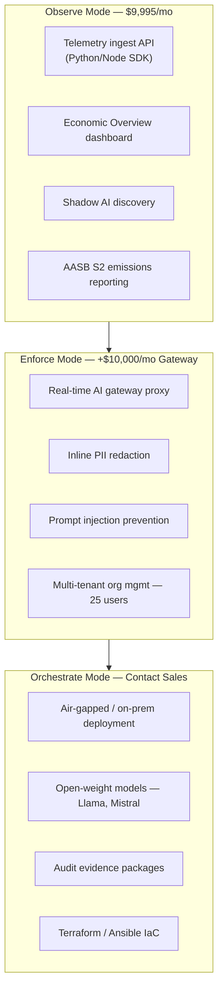
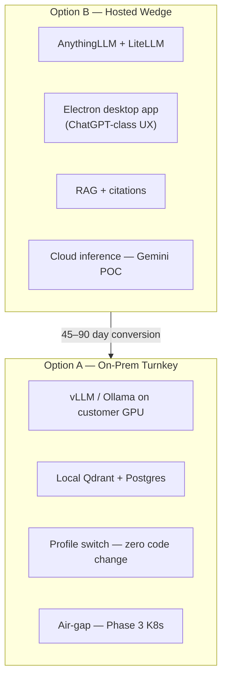
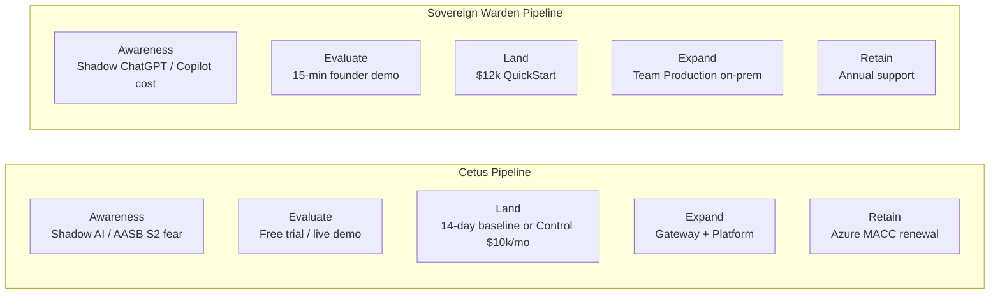

# Cetus AI / Songlines Control® — Competitor Analysis

**Version:** 1.0  
**Date:** July 2026  
**Status:** Strategic intelligence — separate from product roadmap  
**Sources:** [cetusai.com.au](https://www.cetusai.com.au/), [songlinesai.com](https://www.songlinesai.com/) (same product), Architecture Brief v3, existing SW business plan  
**Parent documents:** [competitive-positioning.md](competitive-positioning.md), [competitor-matrix.md](../competitor-matrix.md), [sovereign-warden-business-plan.md](../sovereign-warden-business-plan.md)

> **Note:** Songlines Control® is the product brand. **Cetus AI** is the company (Queensland-based). `songlinesai.com` and `cetusai.com.au` market the same platform. Partner enquiries route to `partners@cetusai.com.au`.

---

## Executive Summary

Cetus AI has materially advanced since our July 2026 competitor matrix was drafted. They are no longer an opaque, on-prem-only enterprise SI — they are a **productised AI governance control plane** with **public Azure Marketplace pricing**, a **three-mode land-and-expand journey** (Observe → Enforce → Orchestrate), and a **Microsoft co-sell channel**. Their entry offer ($9,995/month ≈ $120k/year) targets CISO/procurement buyers who already have AI workloads running and need visibility before they need employee chat UX.

**Strategic verdict:** Cetus and Sovereign Warden are **partially complementary, partially colliding**. They solve different Day-1 pain points:

| Day-1 buyer question | Cetus / Songlines answer | Sovereign Warden answer |
|----------------------|--------------------------|-------------------------|
| "What is our AI spending and who is using what?" | Observe Mode — telemetry ingest in &lt;10 min | Not our core product today |
| "How do we give staff an approved ChatGPT alternative?" | Weak — control plane, not employee UX | **Core product** — desktop app + RAG |
| "How do we enforce policy inline on every AI call?" | Enforce Mode — Gateway proxy (+$10k/mo) | LiteLLM logging only; no inline gateway |
| "How do we run sovereign AI on-prem with air-gap?" | Orchestrate Mode — contact sales | **Option A** — profile switch from hosted pilot |

**Do not reposition Sovereign Warden as a governance control plane in Year 1.** Compete where Cetus is structurally weak (employee adoption, mid-market price, firm-document RAG) and selectively adopt their best GTM and compliance patterns. Full collision occurs at **Orchestrate Mode vs on-prem turnkey** — our differentiation remains speed, UX, and transparent mid-market pricing.

---

## 1. Company Profile

### Cetus AI

| Attribute | Detail |
|-----------|--------|
| **HQ** | Queensland, Australia |
| **Product** | Songlines Control® (governance platform), Songlines Gateway (enforcement proxy) |
| **Positioning** | "Australia's Leader in AI Governance & Sustainability" |
| **Primary buyer** | CISO, CTO, VP Enterprise Architecture, procurement (government + ASX enterprise) |
| **Distribution** | Direct sales, **Microsoft Azure Marketplace** (MACC-eligible), partner program |
| **Co-sell** | Microsoft IP Co-sell Ready |
| **Social proof** | Testimonials from ASX financial services, state government, critical infrastructure (unnamed) |
| **Entry motion** | 14-day "Control Baseline" — inventory, cost attribution, audit evidence, executive readout |

### Relationship to our ICP

| Dimension | Cetus / Songlines | Sovereign Warden (Track A) |
|-----------|-------------------|----------------------------|
| **Employee count** | Enterprise / government (implicit 500+) | **50–250** mid-market |
| **Verticals** | ASX, state gov, critical infrastructure, defence path | Mid-tier law, accounting, boutique finance |
| **Budget gate** | $120k+/yr platform subscription | $12–35k QuickStart / Team Pilot |
| **Procurement path** | Azure MACC, enterprise RFP, compliance evidence pack | Founder SOW, partner vote at $55k+ |
| **Sales cycle** | Weeks (Observe SaaS) to months (Orchestrate) | **4–10 weeks** |

Cetus is **not** optimised for a 75-lawyer firm buying a $12k QuickStart. They are optimised for a CISO who already has Azure OpenAI, Copilot, and shadow ChatGPT and needs a board-ready control story.

---

## 2. Product Architecture Comparison

### Cetus — Three Modes, One Control Plane

**Architecture insight:** Cetus sits **between applications and models** as a governance layer. Existing AI calls are instrumented post-hoc (Observe) or routed through a proxy (Enforce). They do **not** replace the employee chat experience — they govern whatever stack the enterprise already runs.

### Sovereign Warden — Two SKUs, One Platform

**Architecture insight:** We **are** the employee AI stack. Governance is table stakes (LiteLLM logs, RBAC) not the product headline. Land with adoption; expand with sovereignty.

### Collision zone

Both companies converge on **full sovereign on-prem with open-weight models**. Cetus Orchestrate Mode and SW Option A target the same end state. Differentiation at that layer:

| Factor | Cetus Orchestrate | SW Option A |
|--------|-------------------|-------------|
| **Entry path** | Observe SaaS → Gateway → Orchestrate (12–24+ month journey) | Hosted QuickStart → on-prem profile switch (45–90 days) |
| **Employee UX** | Not advertised | **AnythingLLM desktop — core moat** |
| **Pricing transparency** | Contact sales for Orchestrate | Published $55–90k Team Production |
| **Compliance packaging** | IRAP evidence packages, Shared Responsibility Model | Policy templates; IRAP deferred Year 1 |
| **Delivery** | "Structured engagement with sovereign infrastructure team" | Productised 5-day QuickStart runbook |

---

## 3. Feature Comparison (Detailed)

| Capability | **Songlines Control®** | **Sovereign Warden** | Gap severity | Notes |
|------------|------------------------|----------------------|--------------|-------|
| **Employee chat UX** | Not advertised — API/ingest model | ✅ AnythingLLM Desktop | **SW wins** | Cetus is not competing for daily user adoption |
| **RAG / document Q&A** | Enterprise ecosystem (not core) | ✅ Day 1 with citations | **SW wins** | Our ICP needs firm-doc Q&A immediately |
| **AI cost attribution** | ✅ Real-time MTD, per-model, per-workflow, per-user | 🟡 LiteLLM logs only | **Cetus wins** | They built 9 modules around FinOps |
| **Intelligent model routing** | ✅ 30–60% token savings claimed; 19+ model pricing tables | 🟡 LiteLLM config; no auto-routing UI | **Cetus wins** | Major enterprise value prop |
| **Workflow economics** | ✅ Step-level cost/latency breakdown | ❌ Not built | **Cetus wins** | Relevant for agentic workflows |
| **Inline policy enforcement** | ✅ &lt;5ms gateway; PII redaction, injection prevention | ❌ Logging only | **Cetus wins** | Requires Gateway module (+$10k/mo) |
| **Shadow AI discovery** | ✅ 30+ vendors, risk scoring 0–100, declaration portal | 🟡 Narrative in demo; no product | **Cetus wins** | Strong CISO wedge |
| **AASB S2 / emissions** | ✅ Token-level CO₂e, disclosure PDF, director liability | ❌ Not planned | **Cetus wins** | Unique AU board-level hook |
| **Simulation / what-if** | ✅ Cost forecasting before routing changes | ❌ | **Cetus wins** | Enterprise FinOps feature |
| **Immutable audit logs** | ✅ Full-text searchable; compliance export | 🟡 Postgres via LiteLLM | **Cetus wins** | They market this heavily |
| **Compliance evidence pack** | ✅ ISO 27001 Annex A mapping, APS AI Policy, Essential Eight | 🟡 Security policy template | **Cetus wins** | Procurement accelerator |
| **Shared Responsibility Model** | ✅ Four-layer sovereignty boundary doc | ❌ Data-flow diagram only | **Cetus wins** | CISO-grade procurement language |
| **Azure Marketplace** | ✅ Live; MACC-eligible | ❌ | **Cetus wins** | Enterprise procurement channel |
| **Partner program** | ✅ Referral / Reseller / Solution Partner | 🟡 Cyber referral partners (Month 3+) | **Cetus wins** | Formal 3-tier program |
| **Free trial / live demo** | ✅ No-signup live demo; free trial | 🟡 15-min founder demo | **Cetus wins** | Self-serve evaluation |
| **SDK integration** | ✅ Python + Node ingest; &lt;10 min setup | N/A (full stack deploy) | Different model | They attach; we replace |
| **Open-weight models** | ✅ Orchestrate — Llama, Mistral on-prem | ✅ vLLM/Ollama via LiteLLM | Parity | Both support; we ship UX with it |
| **Air-gap deployment** | ✅ Orchestrate Mode | 🟡 Phase 3 K8s | **Cetus wins today** | They ship; we document |
| **SSO (Entra ID)** | ✅ Enterprise | Phase 2 | **Cetus wins today** | |
| **Multi-tenant SaaS** | ✅ Managed SaaS AU East | 🟡 Hosted wedge (single tenant) | **Cetus wins** | Their Observe tier is pure SaaS |
| **White-label branding** | Cetus branding | ✅ Client logo/name/theme | **SW wins** | Mid-market firms want their brand |
| **Time to first value** | ✅ &lt;10 min ingest; 14-day baseline | ✅ 2–4 weeks QuickStart | **Cetus wins on governance**; **SW wins on employee use** | Different "first value" definitions |
| **Desktop native app** | ❌ | ✅ Electron | **SW wins** | |
| **POC → production path** | Phased module upsell | ✅ Profile switch | **SW wins** | No rebuild vs module ladder |
| **Published pricing** | ✅ $9,995/mo base (new since our matrix) | ✅ $12k–$90k packages | **Both** | Different price orders of magnitude |

**Legend:** ✅ = shipped and marketed; 🟡 = partial / planned; ❌ = not present

---

## 4. Pricing & Unit Economics

### Cetus / Songlines — Public Pricing (July 2026)

| Tier | Monthly | Annual | What's included |
|------|---------|--------|-----------------|
| **Songlines Control®** | $9,995 | ~$119,940 | Economic dashboard, policy engine, routing, audit, anomaly detection, AASB S2, Shadow AI, SDK, **up to 5 users** |
| **+ Gateway Module** | +$10,000 | ~$239,880 combined | Inline proxy, PII redaction, injection prevention, multi-tenant (25 users), 8-hr SLA |
| **+ Platform Module** | Contact sales | Est. $400k–$800k+ Year 1 | BYOC, air-gap, custom models, unlimited users, 2-hr SLA, dedicated CSM |

**Additional commercial mechanics:**

- Azure Marketplace transactable — MACC spend applies
- Microsoft IP Co-sell Ready
- Free trial available
- 14-day Control Baseline engagement (positioned as fast proof)

### Sovereign Warden — Track A Pricing

| Package | Price | Annualised equivalent |
|---------|-------|----------------------|
| QuickStart (founding) | $12,000 one-time | N/A — 6-week engagement |
| Team Pilot | $25,000–$35,000 | — |
| Team Production | $55,000–$90,000 | — |
| Annual Support | $6,000–$18,000/yr | Recurring |
| Enterprise deploy (Track B) | $350,000–$650,000 | One-time + support |

### TCO Scenarios

#### Scenario A — 50 users, mid-tier law firm (Track A ICP)

| | Cetus (Observe only) | Cetus (Control + Gateway) | Sovereign Warden |
|--|---------------------|---------------------------|------------------|
| Year 1 | $119,940 | $239,880 | $12,000 (QuickStart) → $55–90k if production |
| Employee chat UX | ❌ — still need Copilot or other | ❌ | ✅ Included |
| RAG over firm docs | ❌ Not core | ❌ | ✅ Included |
| **Realistic total stack** | Cetus + Copilot ≈ **$147k+** | Cetus + Copilot ≈ **$267k+** | **$12–90k** all-in |

**Insight:** For Track A ICP, Cetus is not a substitute — it's an **add-on** unless the firm already has an approved employee AI tool. Our Copilot displacement story remains valid.

#### Scenario B — 500 users, regulated enterprise with existing Azure OpenAI

| | Cetus Control + Gateway | Sovereign Warden Enterprise |
|--|-------------------------|----------------------------|
| Year 1 platform | $239,880 | $85k pilot + $350k deploy ≈ $435k |
| Governance / FinOps | ✅ Best-in-class | 🟡 Basic logging |
| Employee UX | ❌ — separate purchase | ✅ Included |
| Air-gap path | Platform module (opaque) | Phase 3 documented |
| **Buyer likely choice** | CISO buys Cetus for governance; separate employee tool | Single vendor for employee AI + sovereignty |

**Insight:** At enterprise scale, buyers may **buy both** or choose Cetus if they already have Copilot and need governance overlay. We must not assume single-vendor wins.

#### Scenario C — 1,000 users, 3-year TCO (from business plan anchor)

| | Copilot | Cetus (Control + Gateway) | Sovereign Warden |
|--|---------|---------------------------|------------------|
| Year 1 | $540,000 | $239,880 + services | $528,000 |
| Year 2 | $540,000 | $239,880 | $63,000 (support only) |
| Year 3 | $540,000 | $239,880 | $63,000 |
| **3-year total** | **$1,620,000** | **~$719,640** (+ Orchestrate if needed) | **$654,000** |
| Employee UX | ✅ M365 native | ❌ | ✅ Desktop |
| Governance / FinOps | 🟡 M365 compliance centre | ✅ Purpose-built | 🟡 Basic |

**Insight:** Cetus is **cheaper than Copilot** at scale for governance-only layer but **does not include employee productivity**. SW remains compelling on 3-year TCO **when employee UX is in scope**.

### Pricing intelligence gap in our docs

Our [competitor-matrix.md](../competitor-matrix.md) states Cetus pricing is "No (custom quote)" and estimates $300k–$800k Year 1. **Update required:** Base platform is now **public at $119,940/year** on Azure Marketplace. Orchestrate/Platform tier remains opaque.

---

## 5. Go-to-Market & Sales Pipeline Comparison

### Cetus / Songlines GTM

| Channel | Maturity | Mechanism |
|---------|----------|-----------|
| **Azure Marketplace** | Live | Transactable listing; MACC-eligible; reduces procurement friction |
| **Microsoft co-sell** | Active | IP Co-sell Ready — leverage MS field sales |
| **Partner program** | Formal | 3 tiers: Referral, Reseller, Solution Partner; `partners@cetusai.com.au` |
| **Product-led growth** | Strong | Free trial, live demo (no signup), interactive walkthrough, SDK docs |
| **Content / compliance** | Strong | Shared Responsibility Model, compliance evidence pack, architecture brief PDF |
| **Outbound narrative** | "AI is running — are you in control?" | Fear/urgency on shadow AI, unpredictable costs, runtime invisibility |
| **Land offer** | 14-day Control Baseline | Low-risk proof for CISO; produces executive readout |
| **Expand motion** | Module upsell | Control → Gateway (+$10k/mo) → Platform (contact sales) |
| **Sustainability wedge** | Unique | AASB S2 mandatory disclosure — board-level urgency |

### Sovereign Warden GTM (current plan)

| Channel | Maturity | Mechanism |
|---------|----------|-----------|
| **Founder-led sales** | Pre-revenue | Adneo first; law outbound week 7+ |
| **LinkedIn content** | Planned | 1 post/week |
| **Industry associations** | Q3–Q4 2026 | Law Society, CPA/CA ANZ |
| **Referral partners** | Month 3+ | Cybersecurity firms post-Adneo case study |
| **Product-led growth** | Weak | No self-serve trial; 15-min founder demo |
| **Published pricing** | Partial | Plan to publish QuickStart ranges |
| **Land offer** | $12k QuickStart | 6 weeks; employee adoption focus |
| **Expand motion** | Hosted → on-prem profile switch | 45–90 day conversion path |
| **Outbound narrative** | Shadow ChatGPT + Copilot TCO | Productivity + sovereignty |

### Pipeline motion comparison

| Stage | Cetus advantage | SW advantage |
|-------|-----------------|--------------|
| **Awareness** | AASB S2, Azure Marketplace visibility, gov/ASX testimonials | Mid-market law network; Adneo reference |
| **Evaluation** | Self-serve demo; no founder required | Tangible employee UX in demo |
| **Land** | Faster for governance-only ($10k/mo SaaS) | 10× cheaper entry ($12k); includes usable product |
| **Expand** | Module upsell within platform | On-prem conversion without rebuild |
| **Channel** | Microsoft + partners at scale | None yet — founder only |

### Deals we will encounter

| Deal pattern | Likely outcome | Recommended response |
|--------------|----------------|----------------------|
| CISO already evaluating Songlines; asks about employee chat | **Cetus wins governance; we win UX** — risk of "buy Cetus + Copilot" | Position as **all-in-one** employee + sovereignty; TCO vs Cetus+Copilot stack |
| Mid-market law firm, 50 lawyers, no AI governance programme | **SW wins** — Cetus overkill and 10× price | Lead with QuickStart; don't mention Cetus unless asked |
| Enterprise with Azure OpenAI, IRAP requirement | **Cetus wins** Year 1 | Walk away per current strategy; revisit post-IRAP docs |
| SI/partner building Azure OpenAI practice | **Cetus wins** partner motion | Pursue cyber referral channel; consider ISV partnership later |
| Board asks for AASB S2 AI emissions report | **Cetus wins** | Not our Year 1 ICP; monitor for Track B |

---

## 6. Compliance & Sovereignty Positioning

### Cetus — "Sovereignty as Operating Model"

Their strongest non-product asset is **procurement-grade language**:

1. **Shared Responsibility Model** — four layers (Platform Hosting, Model Routing, Identity & Access, Enterprise Ecosystem) with explicit customer vs vendor responsibilities
2. **Deployment tiers** — Managed SaaS (commercial) → BYOC (government) → Air-gapped (classified)
3. **Framework alignment** — Privacy Act 1988, APS AI Policy, ISO/IEC 42001, Essential Eight, ISM Controls
4. **Compliance evidence package** — ISO 27001 Annex A mapping, data residency confirmation, audit log export (500 records + CSV)
5. **Cryptographic claims** — SHA-256 API keys, HMAC-SHA256 webhooks, TLS 1.2+, sub-5ms policy enforcement

**Quote they use in sales:**

> "The right question is not 'Is this sovereign?' — The better question is: 'Which sovereignty boundary are we claiming, and what must the enterprise enforce to preserve it?'"

This directly addresses CISO scepticism of "sovereign washing."

### Sovereign Warden — "Infrastructure You Own"

Our sovereignty story is **asset-based**, not **runtime-governance-based**:

1. Data-flow diagram — prompts never leave network (on-prem profile)
2. Profile switch — POC to production without rebuild
3. Open-weight models — no vendor lock-in via LiteLLM
4. Hardware ownership — CapEx vs perpetual SaaS
5. Essential Eight — documented Phase 3; not yet packaged for assessors

### Gap analysis

| Procurement artefact | Cetus | SW | Priority to close |
|---------------------|-------|-----|-----------------|
| Shared Responsibility Model | ✅ | ❌ | **High** — adapt for SW deployment tiers |
| Compliance evidence PDF | ✅ | ❌ | Medium — post first deployment |
| ISO 27001 mapping | ✅ | ❌ | Medium — Year 2 / seed milestone |
| IRAP-ready evidence | ✅ Claimed | ❌ Deferred | Low Year 1 |
| AASB S2 emissions | ✅ | ❌ | Low — not Track A trigger |
| Architecture brief (customer-facing) | ✅ PDF | 🟡 Internal only | **High** — sales collateral |

---

## 7. SWOT vs Cetus (Focused)

| | **Strengths (vs Cetus)** | **Weaknesses (vs Cetus)** |
|--|--------------------------|---------------------------|
| **Internal** | Employee desktop UX; mid-market pricing; profile-switch architecture; published deployment pricing | No governance FinOps layer; no gateway proxy; no self-serve trial; no marketplace listing |
| **External** | Track A ICP underserved by Cetus pricing; law/accounting need RAG not telemetry | Cetus Azure channel; Microsoft co-sell; first-mover on AASB S2; compliance packaging |

### Opportunities

1. **"Cetus + Copilot" displacement** — position SW as single vendor when buyer would otherwise stack governance + productivity tools
2. **Partner white-label** — mid-market MSPs/cyber firms may prefer reselling employee AI over enterprise governance
3. **Adopt Shared Responsibility Model** — borrow procurement language without building 9 governance modules
4. **LiteLLM cost dashboard** — lightweight Observe-like layer for hosted wedge customers (not full Songlines competitor)

### Threats

1. **Cetus moves downmarket** — unlikely at $10k/mo floor, but Azure MACC could subsidise mid-enterprise
2. **Cetus adds employee chat** — would erode core moat; no signal today
3. **Buyer confusion** — "sovereign AI" category conflation in RFPs; Cetus wins on compliance keywords
4. **Orchestrate Mode matures** — closes on-prem gap with established gov references

---

## 8. Strategic Recommendations

### What to change in current strategy

| Current assumption | Cetus reality | Recommended adjustment |
|--------------------|---------------|------------------------|
| Cetus = slow on-prem SI, opaque pricing | Productised SaaS from $10k/mo; 14-day baseline | Update battlecard; don't claim "opaque pricing" — claim **mid-market accessibility** |
| Cetus = direct on-prem competitor only | Three-mode journey; governance-first | Segment: Cetus for **enterprise governance overlay**; SW for **employee AI platform** |
| Compete on IRAP Year 1 | They have evidence packages | **No change** — continue walking away from IRAP-mandatory |
| Transparency is unique | They publish $9,995/mo | Transparency remains differentiator at **our price point** ($12k vs $120k) |
| Speed to pilot is moat | They claim &lt;10 min ingest | Reframe: **speed to employee adoption**, not speed to telemetry |

### What NOT to do

1. **Do not rebuild Songlines** — nine governance modules is a different company
2. **Do not race to Azure Marketplace** pre-seed — document as Year 2 channel play
3. **Do not pivot messaging to "AI governance platform"** — Cetus owns that category
4. **Do not add Gateway proxy to Year 1 roadmap** — see separate competitive response roadmap below

### What to adopt (selectively)

| Cetus pattern | SW adaptation | Effort |
|---------------|---------------|--------|
| Shared Responsibility Model | 1-page + diagram for hosted vs on-prem tiers | Low |
| 14-day proof narrative | "2-week QuickStart to approved employee AI" | Low — messaging only |
| Architecture brief PDF | Customer-facing 4-pager from existing docs | Medium |
| Compliance evidence pack | Template after first prod deployment | Medium |
| Live demo without signup | Recorded demo environment on website | Medium |
| Partner program | Formalise cyber referral into 2-tier program | Medium |
| AASB S2 / emissions | Monitor; defer unless Track B enterprise asks | High — defer |

---

## 9. Competitive Response Roadmap

> **This section is intentionally separate from the product roadmap** in [operations/product-and-delivery.md](../operations/product-and-delivery.md) and [plan.md](../plan.md). It addresses **market positioning responses to Cetus/Songlines**, not core platform delivery commitments.

### Phase CR-1 — Immediate (Weeks 1–4, pre/post Adneo)

| # | Initiative | Owner | Success metric |
|---|------------|-------|----------------|
| CR-1.1 | Update Cetus battlecard in [competitive-positioning.md](competitive-positioning.md) with public pricing and three-mode journey | Founder | Battlecard reflects $9,995/mo base |
| CR-1.2 | Add "Cetus + Copilot stack" TCO slide to discovery collateral | Founder | Used in every law fit call |
| CR-1.3 | Draft **Sovereign Warden Shared Responsibility Model** (1-page) | Founder | Included in security pack |
| CR-1.4 | Refine demo script minute 0–2: distinguish "governance overlay" vs "employee AI platform" | Founder | Prospect can articulate difference |

### Phase CR-2 — Post first logo (Months 2–4)

| # | Initiative | Owner | Success metric |
|---|------------|-------|----------------|
| CR-2.1 | Customer-facing architecture brief PDF (4–6 pages) | Founder | Downloadable from investor pack / website |
| CR-2.2 | Recorded 5-min product walkthrough (no signup) | Founder | LinkedIn + website embed |
| CR-2.3 | Formalise cyber referral partner tier (referral fee or rev share) | Founder | 1 signed referral agreement |
| CR-2.4 | LiteLLM usage dashboard for hosted wedge — basic cost visibility | Founder | Adneo admin can see token spend |

### Phase CR-3 — Post angel bridge (Months 4–9)

| # | Initiative | Owner | Success metric |
|---|------------|-------|----------------|
| CR-3.1 | Compliance evidence pack template (post-Adneo deployment artefacts) | Founder + lawyer | Usable in 1 enterprise deal |
| CR-3.2 | "Employee adoption metrics" report template — counter Cetus governance KPIs | Delivery | Standard in QuickStart success report |
| CR-3.3 | Evaluate Azure Marketplace ISV path — cost/benefit doc only | Founder | Go/no-go decision documented |
| CR-3.4 | Competitive win/loss tracking — tag Cetus in CRM | Founder | 3+ tagged opportunities |

### Phase CR-4 — Seed stage (Months 9–18) — only if Track B expands

| # | Initiative | Owner | Trigger to start |
|---|------------|-------|------------------|
| CR-4.1 | Shadow AI usage survey template for prospects | GTM | 2+ enterprise deals in pipeline |
| CR-4.2 | AASB S2 emissions estimate (token → CO₂e) — partner or build | Product | Enterprise buyer requirement |
| CR-4.3 | Inline PII scan on LiteLLM proxy — lightweight, not full gateway | Product | Lose 2 deals citing inline redaction |
| CR-4.4 | Azure Marketplace listing | BD + eng | $350k+ ARR; 2 enterprise refs |

### Features explicitly deferred (competitive response)

These are **not** recommended even though Cetus has them — wrong category for SW Year 1:

- Full AI gateway proxy with &lt;5ms enforcement
- 9-module governance control plane
- Workflow economics / step-level FinOps
- Simulation engine for routing what-if
- 30+ shadow AI endpoint network scanning
- Director liability / AASB S2 disclosure PDF generation

---

## 10. Updated Battlecard — Cetus AI / Songlines

| Question | Their answer | Our counter |
|----------|--------------|-------------|
| "We need AI governance" | Songlines Control — $10k/mo, live on Azure | "Do your employees have an approved AI tool yet? We deploy that in 2 weeks. Governance without adoption is dashboard theatre." |
| "We need to see AI spend" | Economic Overview — 10 min ingest | "LiteLLM logs token usage today; our focus is eliminating the Copilot bill AND the shadow ChatGPT risk — with one platform." |
| "We need IRAP / gov compliance" | Evidence packages, Orchestrate Mode | Walk away Year 1 — "We're commercial mid-market focused; Cetus is the right call for IRAP." |
| "We need air-gap" | Orchestrate — contact sales | "Same destination — on-prem open models — but we start with employee adoption at $12k, not a 6-month governance engagement." |
| "Cetus is on Azure Marketplace" | MACC-eligible, co-sell | "For 50–250 employee firms, a $120k/year governance subscription plus Copilot is $147k+. We're $12–90k all-in." |
| "They reduce token costs 30–60%" | Intelligent routing | "We eliminate per-token billing entirely on-prem — flat infrastructure you own." |

---

## 11. Intelligence Gaps & Monitoring

| Unknown | How to validate | Review cadence |
|---------|-----------------|----------------|
| Orchestrate Mode pricing | Mystery shop / partner enquiry | Quarterly |
| Actual customer count / logos | LinkedIn, case studies, Azure Marketplace reviews | Quarterly |
| Employee chat product on roadmap | Monitor product releases, job postings | Monthly |
| Mid-market pricing tier | Ask partners channel | Quarterly |
| Win rate when both in deal | CRM tagging from CR-3.4 | Ongoing |

---

## 12. Document Maintenance

| Trigger | Action |
|---------|--------|
| Cetus pricing change | Update §4 and battlecard |
| Cetus launches employee UX | Reassess core moat — escalate to strategy review |
| SW closes deal where Cetus was alternative | Add win story to §5 |
| SW loses to Cetus | Log reason; check CR-4 trigger conditions |
| Azure Marketplace listing goes live (us or them) | Update channel comparison |

---

## Sources

| Source | URL | Accessed |
|--------|-----|----------|
| Cetus AI homepage | https://www.cetusai.com.au/ | July 2026 |
| Songlines Control product site | https://www.songlinesai.com/ | July 2026 |
| Songlines platform modules | https://www.cetusai.com.au/platform.html | July 2026 |
| Architecture Brief v3 | https://www.cetusai.com.au/assets/Songlines-Control-Architecture-Brief-v3.pdf | July 2026 |
| Orchestrate Mode | https://www.cetusai.com.au/songlines-platform.html | July 2026 |
| SW competitor matrix | [competitor-matrix.md](../competitor-matrix.md) | Internal |
| SW business plan | [sovereign-warden-business-plan.md](../sovereign-warden-business-plan.md) | Internal |

*Pricing and feature claims for Cetus/Songlines are from public marketing materials as of July 2026. Revalidate before investor presentations.*
